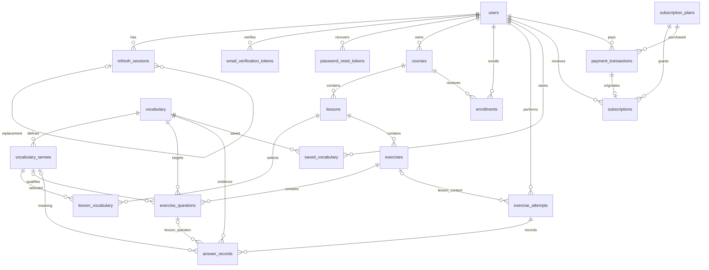

# Database Design

Status: proposed physical design based on approved requirements and database decisions.

## 1. Purpose and scope

Define the initial relational schema for the English Learning Platform. This is
design documentation, not executable SQL, a migration, or authorization to begin
application implementation. The schema contains exactly 18 application tables.
Physical choices below are design proposals; unresolved policy-dependent details
are explicitly provisional rather than new business requirements.

## 2. Source of truth and approved decisions

Sources:

- [Agent instructions](../AGENTS.md)
- [Project specification](PROJECT_SPEC.md)
- [Requirements](REQUIREMENTS.md)
- [Business rules](BUSINESS_RULES.md)
- [Use cases](USE_CASES.md)
- [Domain model](DOMAIN_MODEL.md)
- [Architecture](ARCHITECTURE.md)
- [Requirements analysis skill](../.agents/skills/requirements-analysis/SKILL.md)
- [English learning domain skill](../.agents/skills/english-learning-domain/SKILL.md)
- [System design skill](../.agents/skills/system-design/SKILL.md)
- [Authentication security skill](../.agents/skills/authentication-security/SKILL.md)

The user explicitly approved these five decisions during database-design review:

1. Plans are database-backed catalog records. Payments preserve actual historical
   amount and currency independently of catalog changes.
2. Each verified successful purchase or renewal creates an immutable entitlement
   period linked to exactly one originating payment. Failed/invalid payments
   remain history and create no entitlement. Approved renewal timing is retained.
3. Review reuses attempts and answers with explicit LESSON/REVIEW context. Review
   requires neither a fake Lesson nor a fake Exercise.
4. Minimal immutable historical snapshots preserve understandable results after
   content changes. A general content-versioning system is not required.
5. Recently learned vocabulary derives from answer/attempt evidence and timestamps;
   passive vocabulary viewing is not tracked for this purpose.

These resolve the prior P0 questions. Domain Model section 21 still contains the
older open subscription-history choice; its resolution is recorded here without
editing that document. The approved Review refinement extends its Lesson-centric
attempt relationships. Other open P1/P2 decisions remain open.

Traceability: DM-SUB-001, DM-SUB-002, DM-PAY-001, DM-ATT-001, DM-ATT-002;
BR-SUB-001, BR-PAY-001, BR-DATA-003, BR-REV-001, FR-REV-005.

## 3. Design principles

- Spring Boot is authoritative for core application data and business decisions.
- Normalize identities, vocabulary, relationships and financial evidence; avoid
  duplicate mutable sources of truth.
- STUDENT/TEACHER/ADMIN are authorization roles. STANDARD/PREMIUM describe Student
  access and Course access classification, never security roles.
- Derive current Premium from entitlement periods; there is no User Premium flag.
- Preserve learning, financial, subscription and ownership history.
- Use fixed checked values instead of speculative lookup/RBAC tables.
- Use shared core exercise structures, not a generalized assessment engine.
- Keep PostgreSQL portability practical; no provider-specific business schema.
- A database FK establishes existence, not permission. Backend authorization remains
  required even when all constraints pass.

## 4. Naming, type and key conventions

- Names use snake_case. Each table has an `id` bigint primary key with identity-style
  generation. IDs are internal identifiers, not authorization evidence.
- All absolute timestamps use timestamptz. User-facing time zones are presentation
  concerns; timestamps do not encode a user's original time-zone preference.
- Monetary values use exact numeric, never floating point. Precision and permitted
  currency scale remain provider/catalog validation details; no arbitrary scale is
  imposed before the currency policy is known.
- Text uses text unless a fixed checked set provides a better constraint. No
  undocumented password, title or definition length limits are introduced.
- JSONB is limited to approved question-format payloads, not arbitrary provider
  responses or a generic assessment framework. Its shape is backend-validated.
- In specifications, N means NOT NULL; Y means nullable. Default `none` means no
  database default. `NULL` is the default for an optional unset field.
- `identity` and `current timestamp` describe defaults, not executable DDL.
- Every listed FK uses restrictive deletion and stable referenced IDs. No cascading
  deletion is proposed. Optional FKs also restrict deletion while populated.
- Every id is a PK. Every FK targets the named table's id. Unique/PK indexes are
  not duplicated by additional indexes.
- updated_at has no automatic-on-update assumption: the backend maintains it.
- Row-local checks and cross-record backend checks are specified separately.

## 5. Final table inventory

| Table | Responsibility |
|---|---|
| users | Shared identity, credentials, role and account eligibility |
| refresh_sessions | Refresh credential expiration/revocation state |
| email_verification_tokens | Account-bound verification credentials |
| password_reset_tokens | Account-bound single-use recovery credentials |
| courses | Teacher-owned classified learning Courses |
| lessons | Ordered Course learning content |
| vocabulary | Shared canonical words and available metadata |
| vocabulary_senses | Definitions and meanings of a word |
| lesson_vocabulary | Ordered Lesson selection of particular senses |
| exercises | Lesson assessments of approved core types |
| exercise_questions | Trusted questions and evaluation content |
| enrollments | Student participation in Courses |
| exercise_attempts | LESSON/REVIEW attempt context and results |
| answer_records | Answer evidence and historical snapshots |
| saved_vocabulary | Personal saved-word associations |
| subscription_plans | Database-backed Premium catalog |
| subscriptions | Immutable purchased entitlement periods |
| payment_transactions | Verified and unsuccessful payment history |

## 6. Detailed table specifications

### 6.1 users

Traceability: DM-USER-001, DM-USER-002, BR-ROLE-001, BR-AUTHN-001 through
BR-AUTHN-005, BR-AUTHN-017 through BR-AUTHN-023.

| Column | Type | Null | Default | Purpose/key |
|---|---|---|---|---|
| id | bigint | N | identity | PK |
| email | text | N | none | Login/contact address |
| password_hash | text | N | none | Spring Security-compatible encoded password |
| full_name | text | N | none | Required User display/full name; maximum 200 characters |
| avatar_url | text | Y | NULL | Optional absolute HTTPS profile image reference; maximum 2048 characters |
| role | text | N | none | STUDENT, TEACHER or ADMIN |
| account_status | text | N | none | PENDING_VERIFICATION, ACTIVE, LOCKED or DISABLED |
| email_verified_at | timestamptz | Y | NULL | Successful verification evidence |
| created_at | timestamptz | N | current timestamp | Creation |
| updated_at | timestamptz | N | current timestamp | Last change |

Unique: email; comparison/normalization semantics are provisional (P1). The backend
and database must use the same approved identity semantics before implementation.
Checks: role and account_status belong to the stated sets.
No role/status defaults apply globally: public registration explicitly assigns
STUDENT and PENDING_VERIFICATION; privileged provisioning follows its own approved
workflow. Account status and email verification are distinct, not interchangeable.
Under BR-PROFILE-001, full_name is required for every User creation, including
Student registration and authorized Teacher provisioning. Spring Boot trims
surrounding whitespace and rejects null/blank names. Database CHECKs require a
nonblank full_name of at most 200 characters and, when present, avatar_url of at
most 2048 characters. Spring Boot validates absolute HTTPS URL syntax/scheme;
no reachability check, upload, proxy, image download or media service is implied.
No uniqueness, index or FK is added for either field. PATCH omission preserves
either field; null fullName is rejected and null avatarUrl clears the reference.
Only eligible Students/Teachers may self-edit these fields; other identity,
security and entitlement fields remain excluded. Password changes are separate;
email changes remain unsupported. Admin self-edit is not granted.

### 6.2 refresh_sessions

Traceability: DM-AUTH-001, BR-AUTHN-007 through BR-AUTHN-011.

| Column | Type | Null | Default | Purpose/key |
|---|---|---|---|---|
| id | bigint | N | identity | PK |
| user_id | bigint | N | none | FK users.id |
| credential_hash | text | N | none | Non-raw refresh credential identifier/hash |
| issued_at | timestamptz | N | current timestamp | Issuance |
| expires_at | timestamptz | N | none | Configured expiration |
| revoked_at | timestamptz | Y | NULL | Server-side invalidation |
| replaced_by_id | bigint | Y | NULL | FK refresh_sessions.id; provisional rotation lineage |

Unique: credential_hash. Checks: expires_at after issued_at; revoked_at, when set,
not before issued_at; replacement cannot reference itself.
Index: user_id for applicable session lookup/revocation. The optional replacement
pointer documents a minimal possible rotation representation, not an approved replay,
family-revocation or concurrent-session policy. Same-User linkage and absence of
lineage cycles require backend validation if this provisional field is retained.
No unique user_id; do not accidentally impose a single-session policy.

### 6.3 email_verification_tokens

Traceability: DM-AUTH-002, BR-AUTHN-004 through BR-AUTHN-006.

| Column | Type | Null | Default | Purpose/key |
|---|---|---|---|---|
| id | bigint | N | identity | PK |
| user_id | bigint | N | none | FK users.id |
| credential_hash | text | N | none | Purpose-specific credential hash |
| created_at | timestamptz | N | current timestamp | Issuance |
| expires_at | timestamptz | N | none | Policy-defined expiration |
| consumed_at | timestamptz | Y | NULL | Successful consumption |

Unique: credential_hash. Checks: expires_at after created_at; consumed_at, if set,
not before created_at. Index: user_id for account verification workflows.
The backend checks expiry and eligible account state at consumption. No unique
user_id or one-live-token constraint is imposed before resend policy is approved.

### 6.4 password_reset_tokens

Traceability: DM-AUTH-003, BR-AUTHN-014 through BR-AUTHN-016.

| Column | Type | Null | Default | Purpose/key |
|---|---|---|---|---|
| id | bigint | N | identity | PK |
| user_id | bigint | N | none | FK users.id |
| credential_hash | text | N | none | Purpose-specific recovery hash |
| created_at | timestamptz | N | current timestamp | Issuance |
| expires_at | timestamptz | N | none | Configured expiration |
| consumed_at | timestamptz | Y | NULL | Single-use consumption evidence |

Unique: credential_hash. Checks: expires_at after created_at; consumed_at, if set,
not before created_at. Index: user_id. Consumption and password change must be
atomic against replay. Session invalidation following reset remains unresolved.

### 6.5 courses

Traceability: DM-COURSE-001, BR-COURSE-001 through BR-COURSE-006, BR-CSTATUS-001
through BR-CSTATUS-003, BR-CEFR-003.

| Column | Type | Null | Default | Purpose/key |
|---|---|---|---|---|
| id | bigint | N | identity | PK |
| teacher_id | bigint | N | none | FK users.id; owner |
| title | text | N | none | Course name |
| description | text | Y | NULL | Description |
| cefr_level | text | N | none | A1, A2, B1, B2, C1 or C2 |
| publication_status | text | N | DRAFT | DRAFT, PUBLISHED or ARCHIVED |
| access_classification | text | N | none | STANDARD or PREMIUM |
| created_at | timestamptz | N | current timestamp | Creation |
| updated_at | timestamptz | N | current timestamp | Last edit |

Checks: enumerated CEFR, publication and classification sets. Backend verifies
Teacher ownership and Admin classification authority. Spring Boot explicitly
supplies DRAFT and STANDARD on Teacher creation; access_classification retains no
database default. Teacher create/update DTOs exclude accessClassification while
preserving all other approved owned-Course editing, content management and
publish/archive capabilities. Admin classification operations remain separate. Requiring CEFR at draft
creation is a proposed validation choice; only published-course completeness is a
business requirement, so draft nullability may be refined during API design.
Indexes: teacher_id for owned Courses; (publication_status, cefr_level,
access_classification) for published-course browsing/filtering.

### 6.6 lessons

Traceability: DM-LESSON-001, BR-LESSON-001 through BR-LESSON-004, BR-CCOMP-001.

| Column | Type | Null | Default | Purpose/key |
|---|---|---|---|---|
| id | bigint | N | identity | PK |
| course_id | bigint | N | none | FK courses.id |
| title | text | N | none | Lesson label |
| topic | text | Y | NULL | Topic metadata |
| content | text | Y | NULL | Learning content |
| position | integer | N | none | Display order |
| is_required | boolean | N | none | Required for Course completion; provisional mapping |
| created_at | timestamptz | N | current timestamp | Creation |
| updated_at | timestamptz | N | current timestamp | Last edit |

Check: position nonnegative. Index: (course_id, position, id) for stable ordering.
No unique title or order constraint is required. is_required represents existing
required-Lesson terminology, not approval for a new optional-Lesson workflow;
initial assignment and changes to completion configuration remain P1.

### 6.7 vocabulary

Traceability: DM-VOC-001, DM-VOC-004, BR-VOC-001, BR-VOC-002, BR-VOC-006, BR-DIC-004.

| Column | Type | Null | Default | Purpose/key |
|---|---|---|---|---|
| id | bigint | N | identity | PK |
| word | text | N | none | Display/canonical word |
| canonical_key | text | N | none | Provisional normalized duplicate-prevention key |
| cefr_level | text | Y | NULL | Optional known CEFR level |
| ipa | text | Y | NULL | Available pronunciation text |
| audio_reference | text | Y | NULL | Provisional approved playable reference, not audio bytes |
| source_provider | text | Y | NULL | Provenance where applicable |
| source_reference | text | Y | NULL | Provider record reference where applicable |
| created_at | timestamptz | N | current timestamp | Creation |
| updated_at | timestamptz | N | current timestamp | Last edit |

Unique: canonical_key; exact generation and equality semantics unresolved (P1).
Check: non-null cefr_level belongs to A1-C2. Canonical lookup uses its unique index;
substring/fuzzy indexing is not assumed. Audio/provenance columns are provisional
until provider rights and audio strategy are approved. They do not authorize
storage, caching or redistribution. No separate audio/provider table is introduced.

### 6.8 vocabulary_senses

Traceability: DM-VOC-002, BR-VOC-003 through BR-VOC-005, BR-DIC-004.

| Column | Type | Null | Default | Purpose/key |
|---|---|---|---|---|
| id | bigint | N | identity | PK |
| vocabulary_id | bigint | N | none | FK vocabulary.id |
| part_of_speech | text | Y | NULL | Available grammatical metadata |
| english_definition | text | Y | NULL | Available definition |
| vietnamese_meaning | text | Y | NULL | Available meaning |
| example_sentence | text | Y | NULL | Available example |
| source_provider | text | Y | NULL | Sense-level provenance |
| source_reference | text | Y | NULL | Provider reference |
| created_at | timestamptz | N | current timestamp | Creation |
| updated_at | timestamptz | N | current timestamp | Last edit |

Index: vocabulary_id for word details. Do not make (vocabulary_id, part_of_speech)
unique: a word can have multiple senses of the same part of speech. Content
completeness for a particular exercise is backend validation, not an invented
requirement that every dictionary entry has all metadata.

### 6.9 lesson_vocabulary

Traceability: DM-VOC-003, BR-VOC-005, BR-DATA-002.

| Column | Type | Null | Default | Purpose/key |
|---|---|---|---|---|
| id | bigint | N | identity | PK |
| lesson_id | bigint | N | none | FK lessons.id |
| vocabulary_sense_id | bigint | N | none | FK vocabulary_senses.id |
| position | integer | N | none | Display order |

Unique: (lesson_id, vocabulary_sense_id). Check: position nonnegative.
Indexes: (lesson_id, position, id) for ordered vocabulary; vocabulary_sense_id for
reverse usage checks. Do not duplicate vocabulary_id: it follows from the sense.
Deleting this association never deletes the shared word or sense.

### 6.10 exercises

Traceability: DM-EX-001, BR-LCOMP-002, FR-TEX-001 through FR-TEX-005.

| Column | Type | Null | Default | Purpose/key |
|---|---|---|---|---|
| id | bigint | N | identity | PK |
| lesson_id | bigint | N | none | FK lessons.id |
| exercise_type | text | N | none | FILL_WORD, LISTENING or QUIZ |
| title | text | Y | NULL | Optional label |
| instructions | text | Y | NULL | Assessment instructions |
| position | integer | N | none | Display order |
| is_required | boolean | N | none | Provisional mapping of required assessment sections |
| created_at | timestamptz | N | current timestamp | Creation |
| updated_at | timestamptz | N | current timestamp | Last edit |

Checks: approved exercise_type; nonnegative position. Index: (lesson_id, position,
id). Do not impose one Exercise per type per Lesson without a requirement.
Mapping required sections to individual exercises remains P1. No speculative
advanced-exercise entitlement fields are added before that feature matrix is defined.

### 6.11 exercise_questions

Traceability: DM-EX-002, BR-EX-001, BR-EX-003, BR-LIS-001.

| Column | Type | Null | Default | Purpose/key |
|---|---|---|---|---|
| id | bigint | N | identity | PK |
| exercise_id | bigint | N | none | FK exercises.id |
| vocabulary_id | bigint | N | none | FK vocabulary.id; target word |
| vocabulary_sense_id | bigint | Y | NULL | FK vocabulary_senses.id; selected meaning when relevant |
| question_format | text | N | none | Approved format code |
| prompt | text | N | none | Trusted question content |
| answer_options | jsonb | Y | NULL | Provisional array of fixed-format option identifiers/text |
| expected_answer | text | N | none | Trusted expected text or correct option identifier |
| audio_reference | text | Y | NULL | Provisional playable reference for Listening |
| position | integer | N | none | Display order |

Checks: question_format is FILL_WORD, LISTEN_AND_CHOOSE, LISTEN_AND_TYPE,
WORD_TO_DEFINITION, DEFINITION_TO_WORD, IPA_TO_WORD or CONTEXT_TO_WORD; position is
nonnegative; answer_options, if supplied, is a JSON array. Exact option shape remains
P1. Backend validates format/type compatibility, options, expected answer, selected
sense ownership, Lesson relevance and playable Listening audio. vocabulary_id is
retained because word-only questions need not select a sense; a supplied sense must
belong to that word. Index: (exercise_id, position, id).

### 6.12 enrollments

Traceability: DM-ENR-001, BR-ENR-001 through BR-ENR-005.

| Column | Type | Null | Default | Purpose/key |
|---|---|---|---|---|
| id | bigint | N | identity | PK |
| student_id | bigint | N | none | FK users.id |
| course_id | bigint | N | none | FK courses.id |
| enrolled_at | timestamptz | N | current timestamp | Enrollment time |

Unique: (student_id, course_id). Index: course_id for Course analytics.
No withdrawal/re-enrollment lifecycle has been approved; this is the minimal
one-association mapping. Revisit uniqueness only if that lifecycle is introduced.
Backend verifies STUDENT role, publication/access eligibility and Premium as needed.

### 6.13 exercise_attempts

Traceability: DM-ATT-001, BR-SCORE-001 through BR-SCORE-004, BR-ACC-001,
BR-HIST-001 through BR-HIST-003; approved C3 and C4.

| Column | Type | Null | Default | Purpose/key |
|---|---|---|---|---|
| id | bigint | N | identity | PK |
| student_id | bigint | N | none | FK users.id |
| context | text | N | none | LESSON or REVIEW |
| exercise_id | bigint | Y | NULL | FK exercises.id; required only for LESSON |
| exercise_type | text | N | none | Snapshot of approved core activity type |
| course_title_snapshot | text | Y | NULL | Historical Course label for LESSON |
| lesson_title_snapshot | text | Y | NULL | Historical Lesson label for LESSON |
| started_at | timestamptz | N | current timestamp | Start |
| completed_at | timestamptz | Y | NULL | NULL until completed |
| total_questions | integer | N | none | Captured assessment denominator |
| answered_count | integer | Y | NULL | Final answered count |
| correct_count | integer | Y | NULL | Final correct count |
| score | numeric | Y | NULL | Final backend score percentage |
| accuracy | numeric | Y | NULL | Final percentage; NULL when no answers |

Checks: context is LESSON/REVIEW; approved exercise_type; total_questions positive.
LESSON requires exercise_id and both title snapshots. REVIEW requires these three
fields to be NULL. completed_at, if set, is not before started_at. Before completion,
final counts/score/accuracy are NULL; on completion counts and score are required,
0 <= correct_count <= answered_count <= total_questions, and score is within 0-100.
For completed attempts, accuracy is NULL exactly when answered_count is zero; otherwise within 0-100.
These checks must use explicit NULL handling, not rely on comparisons with NULL.
Zero-answer completion eligibility remains API/workflow policy; this representation
does not mandate accepting it. Completion itself represents attempt status; no
redundant mutable status is added. A Review attempt uses one core activity type;
mixed-type Review sessions are not a newly introduced requirement.
Indexes: (student_id, completed_at, id) for history; (student_id, exercise_id,
completed_at) for Lesson progress. No unique Student/Exercise constraint.

### 6.14 answer_records

Traceability: DM-ATT-002, BR-EX-003, BR-DATA-003, BR-MAST-001 through BR-MAST-003;
approved C3, C4 and C5.

| Column | Type | Null | Default | Purpose/key |
|---|---|---|---|---|
| id | bigint | N | identity | PK |
| attempt_id | bigint | N | none | FK exercise_attempts.id |
| question_id | bigint | Y | NULL | FK exercise_questions.id; LESSON only |
| vocabulary_id | bigint | N | none | FK vocabulary.id; stable aggregation identity |
| vocabulary_sense_id | bigint | Y | NULL | FK vocabulary_senses.id; when relevant |
| position | integer | N | none | Answered question slot within attempt |
| question_format_snapshot | text | N | none | Approved question format at evaluation |
| word_snapshot | text | N | none | Target word at evaluation |
| sense_snapshot | text | Y | NULL | Relevant meaning/definition when needed |
| prompt_snapshot | text | N | none | Minimum interpretable prompt/context |
| submitted_answer | text | N | none | Typed answer or selected option text |
| expected_answer_snapshot | text | N | none | Expected text/correct option text |
| is_correct | boolean | N | none | Trusted backend result |
| answered_at | timestamptz | N | current timestamp | Evidence timestamp |

Unique: (attempt_id, position). Checks: nonnegative position; question format belongs
to the same approved set as exercise_questions. Index: (vocabulary_id, answered_at,
attempt_id) for performance/recent evidence; question_id for referenced-question
lookup. The attempt-prefix unique index supports answer listing.
Backend requires question_id for LESSON and NULL for REVIEW, verifies question
membership and type compatibility, and checks selected sense belongs to vocabulary.
These are cross-row rules, not row-local CHECK constraints. Slot identity prevents
duplicate persistence of the same answer without forbidding legitimate repeated
words. Whether an unanswered slot is persisted is not assumed: total_questions
preserves the denominator even when no AnswerRecord exists for a skipped question.

### 6.15 saved_vocabulary

Traceability: DM-SAVE-001, BR-SAVE-001 through BR-SAVE-004.

| Column | Type | Null | Default | Purpose/key |
|---|---|---|---|---|
| id | bigint | N | identity | PK |
| student_id | bigint | N | none | FK users.id |
| vocabulary_id | bigint | N | none | FK vocabulary.id |
| saved_at | timestamptz | N | current timestamp | Save time |

Unique: (student_id, vocabulary_id). Index: (student_id, saved_at, id) for My
Vocabulary chronological listing. Removing a saved association is allowed by the
documented workflow; it does not remove Vocabulary or historical answers.

### 6.16 subscription_plans

Traceability: DM-SUB-001, BR-SUB-001; approved C1.

| Column | Type | Null | Default | Purpose/key |
|---|---|---|---|---|
| id | bigint | N | identity | PK |
| plan_type | text | N | none | MONTHLY or YEARLY |
| display_name | text | N | none | Catalog display label |
| price | numeric | N | none | Current catalog price |
| currency | text | N | none | Catalog currency |
| is_available | boolean | N | false | Offered for purchase after explicit activation |
| created_at | timestamptz | N | current timestamp | Creation |
| updated_at | timestamptz | N | current timestamp | Last catalog edit |

Checks: MONTHLY/YEARLY and nonnegative price. No unique plan_type: multiple retained
catalog records must not be forbidden merely to simplify history. No extra index
is justified for the small initial catalog. Price/currency configuration and exact
calendar-month/year boundary semantics remain P1. Existing periods are not
recalculated when the catalog changes. Availability default is a conservative
catalog-write default, not a new approval workflow.

### 6.17 subscriptions

Traceability: DM-SUB-002, BR-SUB-002 through BR-SUB-005, NFR-DATA-008; approved C2.

| Column | Type | Null | Default | Purpose/key |
|---|---|---|---|---|
| id | bigint | N | identity | PK |
| student_id | bigint | N | none | FK users.id |
| plan_id | bigint | N | none | FK subscription_plans.id |
| originating_payment_id | bigint | N | none | FK payment_transactions.id |
| starts_at | timestamptz | N | none | Granted period start |
| ends_at | timestamptz | N | none | Granted period end |
| created_at | timestamptz | N | current timestamp | Grant creation |

Unique: originating_payment_id. Check: ends_at after starts_at.
Index: (student_id, ends_at, starts_at) for current coverage and latest granted end.
No mutable ACTIVE/EXPIRED column: current coverage is derived using starts_at <=
current time < ends_at. A future renewal period does not grant access early.
All grant fields are immutable after insertion under backend write boundaries.
No row CHECK is claimed to enforce immutability or verified-payment state.
Refund/revocation modifications are not invented; their design remains P1.

### 6.18 payment_transactions

Traceability: DM-PAY-001, BR-PAY-001 through BR-PAY-005, BR-REVN-001 through
BR-REVN-003, NFR-DATA-007; approved C1 and C2.

| Column | Type | Null | Default | Purpose/key |
|---|---|---|---|---|
| id | bigint | N | identity | PK |
| student_id | bigint | N | none | FK users.id |
| plan_id | bigint | N | none | FK subscription_plans.id |
| plan_type_snapshot | text | N | none | Purchased MONTHLY/YEARLY terms |
| amount | numeric | N | none | Actual historical transaction amount |
| currency | text | N | none | Actual historical transaction currency |
| provider | text | N | none | Selected provider identifier |
| provider_reference | text | Y | NULL | Reference when assigned by provider |
| provider_status | text | Y | NULL | Non-authoritative raw status code, not payload |
| verification_outcome | text | N | UNVERIFIED | Provisional normalized outcome |
| initiated_at | timestamptz | N | current timestamp | Payment initiation |
| verified_at | timestamptz | Y | NULL | Trusted successful verification time |

Unique: (provider, provider_reference) for populated references. Namespace/scoping
must be checked against the selected provider; NULL allows failed initiation with
no assigned reference. Checks: nonnegative amount; approved plan_type_snapshot;
provisional verification_outcome set UNVERIFIED, VERIFIED_SUCCESS, REJECTED.
VERIFIED_SUCCESS requires verified_at; other outcomes require it to be NULL;
verified_at cannot precede initiated_at. These three values distinguish grant
eligibility, not a complete provider state machine. Detailed failure, cancellation,
refund mapping and final constraint vocabulary remain P1.
Indexes: (student_id, initiated_at, id) for payment history;
(verification_outcome, verified_at) for verified-revenue queries.
No reverse subscription_id is stored: the unique originating_payment_id already
expresses the relationship without a circular mutable link.

## 7. Relationships and Mermaid ERD

Each child FK references one parent unless its column is nullable. Parents can
initially have zero children. A User acting as Teacher owns many Courses; a User
acting as Student enrolls, saves vocabulary, learns and purchases Premium. Roles
are validated by Spring Boot, not inferred from FK names.



The self-reference depicts only nullable replacement lineage; it does not approve
a many-branch rotation policy. Conditional LESSON/REVIEW requirements cannot be
fully expressed by ERD optionality; section 9 is normative for those conditions.

## 8. Authentication persistence

One User identity serves all roles. Authentication owns refresh, verification and
reset persistence; User identity remains in the user feature. Keep Spring Security
and JWT components in features/auth/security/. Access Tokens have no database table.

Preserve configurable approved defaults: Access Token 15 minutes, Refresh Token
7 days and password-reset credential 15 minutes (BR-AUTHN-007, BR-AUTHN-008,
BR-AUTHN-016). Store actual credential expiration, not a hardcoded schema lifetime.
Verification lifetime remains unresolved. Hashes/identifiers are stored rather
than raw bearer credentials; password encoding uses Spring Security facilities.

Backend credential use checks current account state, purpose, expiry, revocation
and consumption. Logout invalidates applicable refresh state; it does not imply
instant revocation of every issued Access Token. Consuming single-use reset state
must be concurrency-safe. Rotation, resend and session invalidation policies stay
open; no Access Token blacklist or extra infrastructure is introduced.

## 9. Lesson and Review persistence

| Condition | LESSON | REVIEW |
|---|---|---|
| Attempt exercise_id | Required | NULL |
| Course/Lesson title snapshots | Required | NULL |
| Answer question_id | Required; belongs to attempt Exercise | NULL |
| Answer word/sense evidence | Required word; sense when relevant | Same |
| Evaluation | Trusted backend question content | Trusted backend generated content |
| Fake Lesson/Exercise | Never | Never |

Backend validation also verifies enrollment/access when applicable, Student identity,
Course ownership for content modification, sense/word consistency and format/type
compatibility. Review prompt/expected-answer snapshots must come from backend
selection/evaluation, never from an untrusted correctness field supplied by a client.
Secure delivery/submission correlation belongs to API design, not a new Review table.

Completed results are immutable. Answers and final attempt aggregates are recorded
consistently; total_questions captures the original denominator. Reattempting creates
a new attempt. Existing content edits cannot change a saved historical score.

## 10. Historical-data preservation

Minimum immutable history captures who learned, when, activity type, Lesson/Course
labels when relevant, target word, relevant meaning when needed, interpretable
prompt, submitted response, expected answer and backend correctness. Attempt counts,
score and accuracy describe the completed evaluation.

For choice formats, retain selected/expected option text rather than relying on
mutable option IDs. Full distractor lists, audio bytes and exact UI presentation are
not retained merely for replay. For Listening, a textual target/context and evaluated
response preserve result interpretation without asserting rights to archive audio.
For definition/context questions, sense_snapshot/prompt_snapshot preserve the text
needed to understand that result; unrelated dictionary fields are not copied.

Canonical IDs remain useful for progress and vocabulary aggregation. Their current
labels and definitions are not the exclusive historical source. Retain referenced
canonical rows under restrictive FKs pending approved deletion workflows. Historical
snapshots do not authorize hard deletion of canonical identities or ownership.

Dictionary licensing applies to snapshot copies too (BR-DIC-004). Only approved,
retainable content may be used where persistent text evidence is necessary. If a
provider does not permit that use, select permitted content or resolve the conflict;
do not silently archive prohibited data. No exact question/UI replay is promised.

## 11. Subscription and payment history

Plans are catalog data. Price, currency and plan type at purchase are captured on
payment_transactions and are not later rewritten from the catalog. Subscription
start/end timestamps preserve the exact granted interval independently of future
plan changes.

Each successful initial purchase or renewal creates one immutable period linked
through a required unique originating_payment_id. A transaction has zero or one
period; every period has exactly one transaction. Failed/invalid payments have zero.
The backend enforces matching Student/plan and VERIFIED_SUCCESS before grant creation.
Finalizing successful verification and creating the grant occur atomically. Repeated
provider notifications must return the existing result rather than grant twice.

Manual renewal while active starts at the end of already-granted continuous
coverage, including previously purchased extensions. Expired renewal starts at
verified activation/payment time, as approved in Business Rules section 37.
The backend serializes competing grants for a Student and rechecks existing periods
inside the transaction; a unique payment link alone cannot prevent overlapping
renewals from different successful payments. No unsupported concurrency mechanism
or exclusion constraint is mandated here.

Current Premium is the existence of a granted period covering the current instant.
Future periods are not active yet; expired periods remain history. No User flag or
mutable subscription ACTIVE/EXPIRED column competes with this calculation. Teacher
and Admin functions remain independent of Student Premium.

Revenue derives from verified successful payments, not plan prices, period count or
frontend success pages. Refund effects remain unresolved and must not be implemented
by deleting a transaction or mutating an immutable historical grant.

## 12. Persisted versus derived data

| Data | Treatment |
|---|---|
| User role/account status | Persisted authoritative identity/eligibility |
| Premium catalog and financial evidence | Persisted independently |
| Entitlement periods | Persisted immutable grants |
| Current STANDARD/PREMIUM access | Derived from current coverage |
| Attempts/answers and snapshots | Persisted trusted evidence |
| Completed attempt score/accuracy | Persisted result; backend checks against evidence |
| Lesson progress | Derived from completed required assessment evidence |
| Course progress | Derived from completed required Lessons |
| Best score | Derived maximum across retained eligible completed attempts |
| Mastery/weak vocabulary | Derived from answer history using approved initial rules |
| Recently learned vocabulary | Derived from answer/attempt evidence and timestamps |
| Review selection | Derived from approved saved/weak/incorrect/recent sources |
| Revenue and enrollment statistics | Derived aggregates |

Admin Overview Dashboard derivation (`FR-AAN-007`, `BR-ADM-007`, `FR-REVN-006`):

| Metric | Existing authoritative evidence |
|---|---|
| Student/Teacher totals | users filtered by STUDENT/TEACHER role |
| Course total | courses |
| Current Premium Students | Distinct student_id with a currently covering entitlement period |
| New subscriptions/renewals | First/subsequent successful grants over complete Student history; include renewals after expiry |
| Total/time-range revenue | Each verified successful payment amount once, by verified_at and currency |
| Successful/confirmed-failed counts | Authoritative payment outcomes; failure mapping remains provisional |
| Revenue by plan | Payment plan_id or plan_type_snapshot and historical amount/currency |

Do not count future period starts as purchase events, multiply revenue through
joins, or label unverified payments as failures. Current plan names are catalog
labels, not historical name snapshots. No table, column, index or ERD change is
required. Existing backend authorization and account-management limits apply.
Reporting timezone, default ranges/boundaries, intervals, total-count status
filters, disabled-Student handling in Premium counts, subscription-event and
failure-report timestamps, provider/refund mapping and dashboard freshness remain
unresolved. These are reporting details, not authorization to add accounting or
reporting infrastructure.

BR-SCORE-001 uses correct/total questions; BR-ACC-001 uses correct/answered questions.
BR-MAST-003 and BR-WEAK-001 require at least three answered vocabulary questions;
below that is insufficient evidence, and mastery below 50 percent is WEAK when
eligible. BR-LCOMP-002 and BR-CCOMP-001/002 define initial completion principles;
viewing vocabulary alone does not complete a Lesson. Configuration mapping and
changes to required content remain P1. No progress/analytics cache table is needed.

## 13. Delete, archive and retention behavior

| Resource | Initial conservative behavior |
|---|---|
| Users/Teachers | Disable/lock according to rules; no cascade into ownership/history |
| Courses | Archive preserves Lessons, enrollment and historical learning |
| Lessons/Exercises/questions | Block hard deletion while referenced; detailed retirement workflow unresolved |
| Vocabulary/senses | Retain referenced canonical identity; removing an association is not global deletion |
| Enrollments | Retain through Premium expiry and Course archival |
| Attempts/answers | Retain completed evidence and immutable results |
| Saved vocabulary | Explicit removal deletes personal association only |
| Plans | Disable availability; retain referenced catalog identity |
| Subscriptions | Preserve immutable historical periods |
| Payments | Preserve financial evidence, including unsuccessful attempts as required |
| Authentication credentials | Revoke/consume as approved; cleanup schedule remains unresolved |

All FKs are restrictive. No default soft-delete flag on every table is introduced.
Teacher disable does not transfer or erase Course ownership. Teacher deletion or
ownership transfer requires an approved workflow. No automatic history expiry or
retention duration is invented (BR-DATA-001 through BR-DATA-003, BR-AUTHN-019).

## 14. Enforcement boundaries and index rationale

| Invariant | Database | Spring Boot |
|---|---|---|
| Referenced row exists | PK/FK | Resolve permitted resource |
| Role/status values | CHECK | Provisioning, transitions and current eligibility |
| Course ownership | Required owner FK | Role, identity and permission checks |
| LESSON/REVIEW attempt shape | Row-local conditional CHECK | Full workflow validation |
| Answer belongs to attempted question/context | FK existence only | Cross-row membership and context checks |
| Sense belongs to word | FK existence only | Cross-record consistency |
| Duplicate associations | UNIQUE | Friendly validation and conflict handling |
| One payment creates at most one period | UNIQUE originating payment | Idempotent atomic verification/grant |
| Grant comes from successful matching payment | FK existence only | Verification outcome, Student and plan equality |
| Grant timing/non-overlap | Positive interval CHECK | Serialized renewal calculation |
| Immutable completed history/grants | Not enforced by row CHECK | Restricted write paths and transactional workflows |
| Premium and scores | Stored evidence/range checks | Trusted derivation/evaluation |

Indexes in table specifications support existing ownership, browsing, history,
progress, credential, subscription and revenue queries. No index is automatically
added to every column. Composite indexes are justified by their leading lookup
columns; a unique/PK index is not duplicated. Search semantics, pagination and
query plans may refine indexes during API/performance design. There is no claim
that the canonical-key index supports arbitrary substring/fuzzy search.

## 15. Supabase-hosted PostgreSQL

```text
Browser
  -> Next.js
  -> Spring Boot REST API
  -> Spring Data JPA / Hibernate
  -> Supabase-hosted PostgreSQL
```

Supabase provides managed PostgreSQL hosting only. Core application access is through
Spring Boot and JPA/Hibernate. There is no direct Next.js/browser database path.
Keep Spring Security + JWT and features/auth/security/ unchanged. Do not duplicate
users into Supabase Auth or introduce Realtime, Storage, Edge Functions or Supabase
business logic. RLS is not a replacement for Spring Boot authorization. This design
adds no Supabase-specific tables, extensions or configuration.

Local PostgreSQL remains valid for development/testing. Next.js and Spring Boot
hosting providers remain unresolved. Connection pooling, backups and operational
credentials are deployment concerns; no actual endpoint, credential or secret is
included here.

## 16. Remaining P1/P2 decisions

No current P0 blocker remains for the approved core model. This document does not
authorize implementation of unresolved dependent behavior. Provisional fields and
constraints are marked in their table specifications and must be revisited when the
relevant policy is approved.

| Priority | Unresolved decision | Design impact |
|---|---|---|
| P1 | Refresh rotation/replay/concurrency/session limits | replaced_by_id and lifecycle/uniqueness remain provisional |
| P1 | Verification resend behavior and lifetime | Multiple outstanding credential handling; no unique User constraint yet |
| P1 | Password change/reset session invalidation | Revocation workflow, not silently all-session logout |
| P1 | Exact email normalization | Provisional email uniqueness semantics |
| P1 | Canonical vocabulary normalization | Provisional canonical_key generation and uniqueness |
| P1 | Detailed deletion, Teacher transfer and retirement | Restrictive defaults; no destructive workflow inferred |
| P1 | Dictionary licensing/storage rights | Provenance and snapshot permission must be verified |
| P1 | Audio strategy and variants | audio_reference mapping is provisional; no speculative audio table |
| P1 | Payment provider status/reference mapping | Outcome vocabulary and provider-reference uniqueness scope provisional |
| P1 | Refund behavior | No invented refund state or mutation of historical grants |
| P1 | Exact price/currency configuration and calendar boundaries | Monetary validation and future period calculation details |
| P1 | Recent-learning time window | Query policy; evidence source already approved |
| P1 | Required-section mapping/content edits | is_required assignment and progress interpretation provisional |
| P1 | Question payload/API lifecycle details | Format-specific options, completion eligibility and secure submissions |
| P1 | Draft completeness | Course draft CEFR nullability provisional |
| P2 | Browser JWT transport/cookies/CORS/CSRF | No schema choice or localStorage policy implied |
| P2 | Password encoding parameters/signing configuration | Use supported security facilities; parameters unresolved |
| P2 | Next.js/Spring Boot deployment providers | Hosting remains open |
| P2 | Connection pooling/backups/secret management | Operational design only |
| P2 | Cleanup scheduling and performance tuning | Follow approved retention; optimize measured queries |

If a later policy/provider imposes a new relational requirement, review that specific
change explicitly. Do not pre-build a generic subsystem to anticipate it.

## 17. Validation checklist

- [x] Exactly 18 detailed table specifications match the approved inventory.
- [x] Each FK points to an existing table/PK; ERD contains every FK relationship.
- [x] Nullable relationships agree with conditional LESSON/REVIEW rules.
- [x] Row-local NULL handling is explicit; cross-row rules are assigned to backend.
- [x] Payment-to-period cardinality is zero-or-one to exactly-one, with a unique FK.
- [x] Financial snapshots and immutable intervals survive catalog changes.
- [x] History uses minimal immutable snapshots without claiming exact replay.
- [x] Roles are distinct from access classification; no mutable User Premium state.
- [x] No cascading deletion destroys ownership, learning or financial history.
- [x] All source identifiers/links exist; remaining decisions stay explicitly open.
- [x] Supabase remains hosting only; Spring Boot authority is preserved.
- [x] Markdown structure, whitespace, CRLF and final newline are verified.
- [x] No application code, SQL, migrations, configuration or dependencies are created.

These are design-review checks. Executable database constraints, transactional tests
and application security tests belong to later approved implementation work; this
document does not claim those tests have run.
