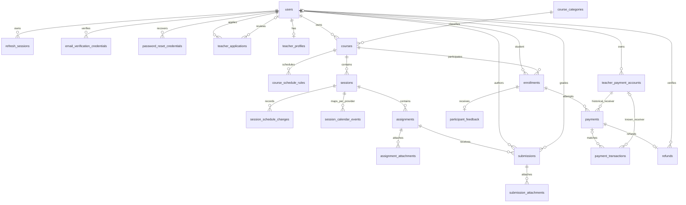

# English Tutoring Platform — Database Design

**Status:** Approved Physical Database V1; implementation requires separate approval.

## 1. Authority, Purpose and Design Status

Authority follows AGENTS.md -> PROJECT_SPEC.md -> REQUIREMENTS.md ->
BUSINESS_RULES.md -> USE_CASES.md -> DOMAIN_MODEL.md -> ARCHITECTURE.md ->
DATABASE_DESIGN.md -> API_DESIGN.md -> TASK_BREAKDOWN.md.
FEATURE_STATUS.md separately owns live implementation status/evidence. Skills are
subordinate working guidance and README is onboarding documentation.

This is the approved 22-table Physical Database V1 direction with the Phase 2
corrections incorporated. Section 17 is a documentation-only SQL specification,
NOT an approved/executable Flyway migration. Section 22 records the final physical
decisions and remaining implementation-only gates. G-PHYSICAL is RESOLVED; TASK-004
is TODO and awaits explicit implementation approval. No SQL execution is authorized.
The historical baseline in section 23 is not current schema authority.


## 2. Database Platform and Persistence Boundary

PostgreSQL is hosted on Supabase for development, with local PostgreSQL supported.
Browser -> Next.js -> Spring Boot REST API -> Spring Data JPA/Hibernate -> PostgreSQL.
Spring Boot owns business authorization; no frontend database access, Prisma,
Supabase Auth/Data API or RLS replacing application authorization.
Supabase Storage is separately approved for the bounded file uses in section 19;
it does not change the core data-access path.

Use public schema, PostgreSQL-portable SQL where practical and controlled Flyway
migrations only after approval. Hibernate/schema initialization remains disabled.
No database connection or mutation is needed for this reconciliation.


## 3. Relational Design Principles

- BIGINT identity primary keys map to Java Long; teacher_profiles.teacher_id is the
  intentional shared PK/FK exception, mapped from User rather than generated.
- lowercase snake_case, plural table names except the approved collective
  participant_feedback name; named PK/FK/UQ/CK/indexes.
- TIMESTAMPTZ / Instant for absolute time; DATE / LocalDate; TIME / LocalTime for
  recurring local rules, interpreted with Course timezone.
- NUMERIC(15,2) / BigDecimal money; finite numeric values and explicit currency.
  NUMERIC(5,2) score precision is approved; no arbitrary maximum of 100 is added.
- Closed lifecycle values use TEXT + CHECK and future EnumType.STRING. Required
  text additionally needs backend nonblank validation. No arbitrary VARCHAR limits.
- Spring Boot/JPA supplies created_at/updated_at; no automatic timestamp triggers,
  default version column, arbitrary JSONB or global soft deletion.
- Restrictive history FKs; CASCADE only true dependent records when parent deletion
  is legitimately permitted. No cascade substitutes for retention authorization.

| Table | Responsibility |
| --- | --- |
| users | Shared identity, single role, verified/locked flags and profile data. |
| refresh_sessions | Hashed refresh credentials, expiry/revocation. |
| email_verification_credentials | Hashed initial/email-change verification authority. |
| password_reset_credentials | Hashed expiring single-use reset authority. |
| teacher_applications | Retained review snapshots and review evidence. |
| teacher_profiles | Current approved public teaching profile, shared User PK. |
| course_categories | Active/inactive administered Categories. |
| courses | Owned commercial unit, tuition/discount/capacity and protected Meet URL. |
| course_schedule_rules | Recurring weekly local schedule. |
| sessions | Fixed planned numbered occurrences and protected nullable content. |
| session_schedule_changes | Old/new occurrence times and change timestamp. |
| session_calendar_events | Provider mapping and synchronization state. |
| enrollments | Unique Student/Course participation and seat reservation. |
| assignments | Session work, deadline/max-score direction and lifecycle. |
| assignment_attachments | Authorized Storage paths and file metadata. |
| submissions | One current Student/Assignment work record and grading/result. |
| submission_attachments | Authorized Submission file paths and metadata. |
| participant_feedback | One completed-Enrollment rating/comment. |
| teacher_payment_accounts | Retained Teacher bank destinations. |
| payments | Historical attempts, price snapshots and confirmation. |
| payment_transactions | Actual bank/provider evidence, potentially unmatched. |
| refunds | One full refund per Payment, proof and Admin verification. |

Exactly 22 application tables. No roles/user_roles, meetings, session_attendance,
course_progress, statistics tables, notification_deliveries, calendar_attendees,
assignment_results or submission_gradings.


## 4. Identity and Authentication Persistence

Each User has exactly one role: STUDENT, TEACHER or ADMIN. Student and Teacher registration
are separate; V1 has no Student-to-Teacher promotion. Teacher business authority requires
TEACHER role, verified email, an unlocked account and approved onboarding. Application
snapshots/history are retained, with at most one PENDING application per Teacher; the
current public TeacherProfile is created after approval and does not rewrite application
snapshots.

V1 uses users.locked as its account-blocking mechanism: a locked account cannot authenticate
or use normal account functionality. There is no separate disabled, enabled or
account_status field/lifecycle. Email uses lowercase(trim(inputEmail)) for storage/login; a verified email
change retains the old email until successful verification of the new one. Password reset
revokes all refresh sessions; logged-in password change revokes other sessions while
preserving the current session. Raw refresh, verification and reset secrets are not
persisted.

Email canonicalization is lowercase(trim(inputEmail)) for registration, login,
verification, email change and password-reset/account lookup. Persist users.email and
verification target_email canonically; do not remove dots/+tags or apply provider-specific
normalization. users.email is UNIQUE; target_email is not unique.
Database CHECKs require email = lower(btrim(email)) and the equivalent for target_email.
Email change verifies the account-bound EMAIL_CHANGE credential, atomically consumes it
and handles the users.email uniqueness race before replacing the old effective email.
No users.pending_email column is introduced. Relevant future Calendar attendees update.
No Access JWT table; credential expiry/revocation/used timestamps support the approved
security flows. Password encoding/transport/replay details are not invented.

References: DM-USER-001, DM-USER-002, DM-AUTH-001, DM-AUTH-002, DM-AUTH-003;
BR-AUTHN-006, BR-AUTHN-013, BR-AUTHN-015, BR-AUTHN-018, BR-AUTHN-019.


## 5. Teacher Profile Persistence

Each User has exactly one role: STUDENT, TEACHER or ADMIN. Student and Teacher registration
are separate; V1 has no Student-to-Teacher promotion. Teacher business authority requires
TEACHER role, verified email, an unlocked account and approved onboarding. Application
snapshots/history are retained, with at most one PENDING application per Teacher; the
current public TeacherProfile is created after approval and does not rewrite application
snapshots.

teacher_profiles.teacher_id is both PK and FK to users, not another identity sequence.
Approval/rejection requires reviewed_at/reviewed_by; rejection requires a reason.
PENDING has no review evidence. FK existence does not prove role or review authority.
Profile edits do not alter application review snapshots.

References: DM-TEA-001, BR-AUTHN-024, BR-PROFILE-002.


## 6. Course and Category Persistence

Every Course has one non-transferable owning Teacher and exactly one Category. Used
Categories are retained and deactivated. Course statuses are DRAFT, PUBLISHED, COMPLETED,
CANCELLED and ARCHIVED; teaching in progress remains PUBLISHED. Teacher explicitly completes
a Course after backend validation. Cancellation and archival are distinct. Optional
percentage-discount windows are supported; Payments retain their price snapshots.

Capacity uses min_students/max_students; min counts ACTIVE only. Preserve tuition,
currency and applicable discount snapshots on each Payment. Meet URL is protected.
meet_url is nullable in DRAFT; Spring Boot requires a valid URL before publication.
Tuition is finite nonnegative NUMERIC(15,2); zero means free. VND is the only currency.
min_students > 0 and max_students >= min_students; session_count is the fixed positive
planned count. Discount fields are either all absent or all present with
0 < discount_percent < 100 and start < end; 100% is not the free-Course representation.

References: DM-COURSE-001, DM-CAT-001, BR-COURSE-001, BR-COURSE-004.


## 7. Session and Scheduling Persistence

Recurring weekly Course rules generate concrete Sessions before publication. Session
statuses are SCHEDULED and CANCELLED only. Rescheduling updates the same Session and appends
old/new times to schedule history. Cancellation preserves the row and session_number,
optionally records a reason and synchronizes cancellation to its Calendar event.
V1 has no replacement or automatic make-up Sessions; cancellation never regenerates
the schedule or changes the fixed planned session_count. Session content is nullable
protected learning content, never public preview content. V1 has no attendance tracking.

sessions.content TEXT NULL stores protected learning content; generated Sessions can
have no content. No public Session projection includes it. UNIQUE(course_id, session_number)
enforces one row per planned number; cancellation preserves the row, number and Course count.
There is no replacement column, self FK, replacement index or replacement CHECK.

Generate exactly session_count Sessions chronologically from planned_start_date
(the earliest permitted date, not necessarily a matching weekday), using weekly rules
with ISO weekdays 1=Monday through 7=Sunday. Number Sessions 1 through session_count,
unique within the Course. Combine date and local times with the required backend-validated
IANA Zone ID to persist TIMESTAMPTZ instants. Same-Course rules must not overlap;
validate overlap transactionally. Draft inputs may change and generated Sessions may
be regenerated only before meaningful historical/business activity. Before publication,
Sessions exist for Teacher review and a valid Teacher-provided Meet URL is required.
After publication, concrete timestamps are authoritative; do not blindly regenerate.
Rescheduling updates the same row and Calendar event; cancellation preserves numbering
and count. Each concrete Session has its own event, never one recurring Calendar event.
Synchronization failure never rolls back core Course/Session state; retain durable
sync status and retry. DST gap/overlap validation remains an implementation contract.

References: DM-SES-001, DM-SCH-001, BR-SES-001, BR-SCH-001.


## 8. Assignment, Submission and Result Persistence

Assignments belong to Sessions and use ACTIVE/CANCELLED. Any Submission prevents hard
deletion of its Assignment. There is one current Submission per Student/Assignment, using
DRAFT/SUBMITTED/GRADED; no revision-history, result or grading table is introduced. Score,
feedback and grading metadata remain on Submission. Only the owning Teacher grades, and a
score cannot exceed Assignment max_score. A numeric score is not made mandatory merely by
GRADED status.

SUBMITTED/GRADED require submitted_at; GRADED additionally requires graded_at and
graded_by, not a mandatory score. Same-row bounds reject NaN; max-score comparison
is cross-table. Optional attachments store names, paths, type and size. Required
due_at is NOT NULL; max_score is positive NUMERIC(5,2) and optional score is
nonnegative NUMERIC(5,2), with no business maximum of 100. No revision/result table.

References: DM-ASN-001, DM-ASN-002, DM-ASN-003, BR-ASN-002, BR-ASN-003.


## 9. Enrollment and Participation Persistence

Enrollment is unique per Student/Course and uses PENDING, ACTIVE, COMPLETED or CANCELLED. A
COMPLETED Enrollment is historical and cannot simply re-enroll into that Course instance.
Free Courses activate participation without fake Payments. Paid participation may reserve a
seat while PENDING. Capacity counts ACTIVE plus PENDING Enrollments with unexpired
reservations; min_students counts ACTIVE only. Expired reservations consume no capacity. No
new Enrollment or Payment may begin after the first Session has started. Activation,
reservation and late-payment handling must be concurrency-safe.

UNIQUE(student_id, course_id) also supports Student-prefix lookup. Status/expiry
values alone do not reserve capacity safely: serialize relevant capacity decisions
with an approved transaction/locking strategy. No wall-clock CHECK or partial index
using current time is proposed.

References: DM-ENR-001, BR-ENR-001, BR-ENR-008.


## 10. Course Progress Persistence

CourseProgress and statistics are derived from authoritative Enrollment, Session and
Submission information; no progress, attendance or statistics table. Formulas and
reporting time boundaries remain open. Opening Meet/content does not prove attendance
or completion.

References: DM-PRO-002, BR-AUTH-006, BR-TEA-002.


## 11. Teacher Payment Receiving Information

Students pay the owning Teacher directly using the VietQR integration direction; the
platform/Admin does not hold tuition or perform payouts. Payments are separate from
Enrollments, have immutable price snapshots and use PENDING, CONFIRMED, EXPIRED or
CANCELLED. An Enrollment may have historical attempts but at most one PENDING Payment.
Teacher bank-account history is retained with at most one ACTIVE account; existing Payments
keep their historical account reference.

The partial unique index enforces at most one ACTIVE bank account per Teacher.
Application logic validates Teacher authority, account ownership and historical
immutability. V1 omits provider_account_ref; a later verified integration may justify
a separately approved migration. It is not a confirmed VietQR field.

References: DM-PAY-002, BR-PAY-006, BR-PAY-007.


## 12. Course Payment / Transaction Persistence

Students pay the owning Teacher directly using the VietQR integration direction; the
platform/Admin does not hold tuition or perform payouts. Payments are separate from
Enrollments, have immutable price snapshots and use PENDING, CONFIRMED, EXPIRED or
CANCELLED. An Enrollment may have historical attempts but at most one PENDING Payment.
Teacher bank-account history is retained with at most one ACTIVE account; existing Payments
keep their historical account reference.

Actual provider/bank transactions may be unmatched. They retain receiving-account context
when resolvable, independently of Payment matching; an unresolved receiver remains a
reconciliation concern. Browser, Student and Teacher claims are not confirmation evidence.
Confirmation requires trustworthy provider/bank evidence matching the intended receiver,
code, amount and currency; wrong/missing codes or amounts do not auto-confirm, partial
transfers are not summed automatically, and late transactions cannot cause overbooking.

V1 supports full refunds only, with at most one Refund per Payment. The amount equals the
applicable full Payment amount under the approved workflow. Teacher performs the bank
transfer back to the Student and submits proof; Admin verifies completion. Refund statuses
are PENDING, SUBMITTED, COMPLETED and CANCELLED. Payment remains historical and has no
REFUNDED status. This does not authorize platform custody, payouts, commissions, escrow or
accounting.

payment_transactions.payment_id and teacher_payment_account_id are independently
nullable. The latter references teacher_payment_accounts(id) ON DELETE RESTRICT.
Unknown receiving accounts stay unresolved for reconciliation; do not fabricate a
receiver or infer a match from amount alone. When matched, verify account coherence.
CONFIRMED requires confirmed_at. Full-refund amount/eligibility is cross-table;
SUBMITTED and COMPLETED require the approved proof/time/reviewer evidence.

V1 omits provider_order_id and its dependent unique index. provider_transaction_id is
retained as external evidence without an unverified provider-wide unique constraint.
The selected adapter must scope transaction identity using its verified source/account
context and serialize duplicate detection, matching and confirmation atomically.
Do not infer identity from amount alone or invent a VietQR API guarantee. This
application/idempotency boundary is mandatory before adapter implementation, not a
physical-design blocker. Do not store raw provider secrets in raw_reference.

References: DM-PAY-001, DM-PAY-002, DM-PAY-003, BR-PAY-009, BR-PAY-011,
UC-PAY-REFUND-01.


## 13. Meet and Calendar Persistence Boundaries

One manually supplied protected Course Meet URL is shared by all Sessions; no Meeting
entity or Meet API. Supply timing/nullability remains a migration clarification.

Google Calendar uses one system/organization account and one configured Calendar,
not per-user OAuth token storage. The Calendar ID belongs to backend configuration/secrets,
not Session rows. Each concrete Session maps to one event; Session remains authoritative.
Synchronize publication, rescheduling and cancellation through durable status/retry;
external failure must not roll back core Course/Session changes. Attendee emails derive
from Users and Enrollments without duplicated email or attendee tables; verified email
changes update relevant future attendees. UNIQUE(session_id, provider) and non-null
(provider, external_event_id) uniqueness apply within V1's single-calendar boundary.
Multi-calendar support requires a future migration. Calendar never creates Meet URLs.

SYNCED requires external_event_id and last_synced_at. Non-null (provider, external_event_id)
uniqueness is approved within V1's single configured Calendar. No calendar_attendees,
calendar_id column or duplicated email columns; persist mapping state, not per-user OAuth.

References: BR-MEET-001, BR-MEET-002, BR-AUTH-005, INV-019, INV-021.


## 14. Participant Feedback Persistence

Participant feedback is unique per Enrollment, can be created only for a COMPLETED
Enrollment and has a rating from 1 to 5. No aggregate rating column is stored.
Editing/moderation details not supplied by these decisions remain open.

The FK/unique key/rating CHECK enforce relationship existence, one row and scale.
COMPLETED eligibility and Student identity are application/transactional invariants.

References: DM-RATE-001, BR-RATE-001.


## 15. Admin and Reporting Data Boundary

Admin uses authorized projections of existing records and verifies full-refund
completion; no tuition custody or payout execution. Derive user/Course/Enrollment
and transaction statistics, preserving currency separation and verified evidence.
Do not equate Teacher tuition with Admin revenue. No materialized reporting tables,
accounting/expense system or invented metrics.

References: BR-ADM-001, BR-ADM-005, BR-PAY-011.


## 16. Relationships and Foreign-Key Direction

The SQL in section 17 and ERD in section 20 define the same relationships. Mandatory
FKs reference one parent; nullable FKs reference zero or one. Course/User ownership
and one Category are mandatory. Student/Course Enrollment and Student/Assignment
Submission are pair-unique; repeated payment attempts are children of one Enrollment.

TeacherProfile is zero-or-one per User; Teacher applications/accounts are one-to-many
with partial unique current-state restrictions. Refund and feedback each have a
unique parent. A Session has at most one Calendar mapping per provider in the single
configured Calendar. No Session-to-Session replacement relationship exists.

All business/history FKs use ON DELETE RESTRICT. Only Course schedule rules and
Assignment/Submission attachment rows use CASCADE as true dependents. Parent hard
deletion must first satisfy retention/authorization; FK cascade does not authorize
it or delete Storage bytes. No SET NULL silently loses historical context.


## 17. Constraints, Uniqueness and Lifecycle Boundaries

The following is the corrected **documentation-only SQL specification** of the
22-table Physical V1. It records database-enforced columns, types, nullability, named
keys, FK deletion behavior, uniqueness, lifecycle CHECKs and indexes. Application
invariants are in section 25; implementation-only details are in section 22.
Do not execute or copy it to Flyway without separate implementation approval.

Same-row evidence CHECKs are one-way implications, preserving historical evidence
when a later legitimate state retains it. Teacher applications additionally require
PENDING to be unreviewed. NUMERIC NaN is rejected explicitly for money/scores;
discount_percent's finite upper bound already rejects it. Keep existing ranges and
BigDecimal mapping. Required text is also validated nonblank in Spring Boot.
Cross-row/time/authorization rules belong in section 25, not SQL triggers.
Technical references: [PostgreSQL numeric
values](https://www.postgresql.org/docs/17/datatype-numeric.html)
and [CHECK constraint limits](https://www.postgresql.org/docs/17/ddl-constraints.html).

```sql
-- =========================================================
-- ENGLISH TUTORING PLATFORM
-- PHYSICAL DATABASE DESIGN V1
-- PostgreSQL
-- =========================================================


-- =========================================================
-- 1. USERS
-- =========================================================

CREATE TABLE public.users (
    id BIGINT GENERATED BY DEFAULT AS IDENTITY,

    email TEXT NOT NULL,
    password_hash TEXT NOT NULL,

    full_name TEXT NOT NULL,
    phone TEXT,
    address TEXT,
    date_of_birth DATE,

    role TEXT NOT NULL,

    email_verified BOOLEAN NOT NULL DEFAULT FALSE,
    locked BOOLEAN NOT NULL DEFAULT FALSE,

    created_at TIMESTAMPTZ NOT NULL,
    updated_at TIMESTAMPTZ NOT NULL,

    CONSTRAINT pk_users PRIMARY KEY (id),

    CONSTRAINT uq_users_email
        UNIQUE (email),

    CONSTRAINT ck_users_email_canonical
        CHECK (email = lower(btrim(email))),

    CONSTRAINT ck_users_role
        CHECK (role IN (
            'STUDENT',
            'TEACHER',
            'ADMIN'
        ))
);


-- =========================================================
-- 2. REFRESH SESSIONS
-- =========================================================

CREATE TABLE public.refresh_sessions (
    id BIGINT GENERATED BY DEFAULT AS IDENTITY,

    user_id BIGINT NOT NULL,

    token_hash TEXT NOT NULL,

    expires_at TIMESTAMPTZ NOT NULL,
    revoked_at TIMESTAMPTZ,

    created_at TIMESTAMPTZ NOT NULL,

    CONSTRAINT pk_refresh_sessions PRIMARY KEY (id),

    CONSTRAINT fk_refresh_sessions_user
        FOREIGN KEY (user_id)
        REFERENCES public.users(id)
        ON DELETE RESTRICT,

    CONSTRAINT uq_refresh_sessions_token_hash
        UNIQUE (token_hash),

    CONSTRAINT ck_refresh_sessions_expiry
        CHECK (expires_at > created_at)
);

CREATE INDEX ix_refresh_sessions_user_id
    ON public.refresh_sessions(user_id);


-- =========================================================
-- 3. EMAIL VERIFICATION CREDENTIALS
-- =========================================================

CREATE TABLE public.email_verification_credentials (
    id BIGINT GENERATED BY DEFAULT AS IDENTITY,

    user_id BIGINT NOT NULL,

    purpose TEXT NOT NULL,
    target_email TEXT NOT NULL,

    secret_hash TEXT NOT NULL,

    expires_at TIMESTAMPTZ NOT NULL,
    used_at TIMESTAMPTZ,

    created_at TIMESTAMPTZ NOT NULL,

    CONSTRAINT pk_email_verification_credentials
        PRIMARY KEY (id),

    CONSTRAINT fk_email_verification_credentials_user
        FOREIGN KEY (user_id)
        REFERENCES public.users(id)
        ON DELETE RESTRICT,

    CONSTRAINT uq_email_verification_credentials_secret
        UNIQUE (secret_hash),

    CONSTRAINT ck_email_verification_credentials_target_canonical
        CHECK (target_email = lower(btrim(target_email))),

    CONSTRAINT ck_email_verification_credentials_purpose
        CHECK (purpose IN (
            'INITIAL_VERIFICATION',
            'EMAIL_CHANGE'
        )),

    CONSTRAINT ck_email_verification_credentials_expiry
        CHECK (expires_at > created_at)
);

CREATE INDEX ix_email_verification_credentials_user
    ON public.email_verification_credentials(user_id);


-- =========================================================
-- 4. PASSWORD RESET CREDENTIALS
-- =========================================================

CREATE TABLE public.password_reset_credentials (
    id BIGINT GENERATED BY DEFAULT AS IDENTITY,

    user_id BIGINT NOT NULL,

    secret_hash TEXT NOT NULL,

    expires_at TIMESTAMPTZ NOT NULL,
    used_at TIMESTAMPTZ,

    created_at TIMESTAMPTZ NOT NULL,

    CONSTRAINT pk_password_reset_credentials
        PRIMARY KEY (id),

    CONSTRAINT fk_password_reset_credentials_user
        FOREIGN KEY (user_id)
        REFERENCES public.users(id)
        ON DELETE RESTRICT,

    CONSTRAINT uq_password_reset_credentials_secret
        UNIQUE (secret_hash),

    CONSTRAINT ck_password_reset_credentials_expiry
        CHECK (expires_at > created_at)
);

CREATE INDEX ix_password_reset_credentials_user
    ON public.password_reset_credentials(user_id);


-- =========================================================
-- 5. TEACHER APPLICATIONS
-- =========================================================

CREATE TABLE public.teacher_applications (
    id BIGINT GENERATED BY DEFAULT AS IDENTITY,

    teacher_id BIGINT NOT NULL,

    specialization TEXT NOT NULL,
    teaching_experience TEXT NOT NULL,
    introduction TEXT NOT NULL,

    status TEXT NOT NULL,

    submitted_at TIMESTAMPTZ NOT NULL,

    reviewed_at TIMESTAMPTZ,
    reviewed_by BIGINT,
    rejection_reason TEXT,

    created_at TIMESTAMPTZ NOT NULL,
    updated_at TIMESTAMPTZ NOT NULL,

    CONSTRAINT pk_teacher_applications
        PRIMARY KEY (id),

    CONSTRAINT fk_teacher_applications_teacher
        FOREIGN KEY (teacher_id)
        REFERENCES public.users(id)
        ON DELETE RESTRICT,

    CONSTRAINT fk_teacher_applications_reviewer
        FOREIGN KEY (reviewed_by)
        REFERENCES public.users(id)
        ON DELETE RESTRICT,

    CONSTRAINT ck_teacher_applications_status
        CHECK (status IN (
            'PENDING',
            'APPROVED',
            'REJECTED'
        )),

    CONSTRAINT ck_teacher_applications_review
        CHECK ((status = 'PENDING' AND reviewed_at IS NULL AND reviewed_by IS NULL AND rejection_reason IS NULL)
            OR (status IN ('APPROVED', 'REJECTED') AND reviewed_at IS NOT NULL AND reviewed_by IS NOT NULL
                AND (status <> 'REJECTED' OR rejection_reason IS NOT NULL)))
);

CREATE INDEX ix_teacher_applications_teacher
    ON public.teacher_applications(teacher_id);

CREATE INDEX ix_teacher_applications_status
    ON public.teacher_applications(status);

CREATE UNIQUE INDEX uq_teacher_applications_one_pending
    ON public.teacher_applications(teacher_id)
    WHERE status = 'PENDING';


-- =========================================================
-- 6. TEACHER PROFILES
-- =========================================================

CREATE TABLE public.teacher_profiles (
    teacher_id BIGINT NOT NULL,

    avatar_path TEXT,

    specialization TEXT NOT NULL,
    teaching_experience TEXT NOT NULL,
    introduction TEXT NOT NULL,

    created_at TIMESTAMPTZ NOT NULL,
    updated_at TIMESTAMPTZ NOT NULL,

    CONSTRAINT pk_teacher_profiles
        PRIMARY KEY (teacher_id),

    CONSTRAINT fk_teacher_profiles_teacher
        FOREIGN KEY (teacher_id)
        REFERENCES public.users(id)
        ON DELETE RESTRICT
);


-- =========================================================
-- 7. COURSE CATEGORIES
-- =========================================================

CREATE TABLE public.course_categories (
    id BIGINT GENERATED BY DEFAULT AS IDENTITY,

    name TEXT NOT NULL,
    active BOOLEAN NOT NULL DEFAULT TRUE,

    created_at TIMESTAMPTZ NOT NULL,
    updated_at TIMESTAMPTZ NOT NULL,

    CONSTRAINT pk_course_categories
        PRIMARY KEY (id),

    CONSTRAINT uq_course_categories_name
        UNIQUE (name)
);


-- =========================================================
-- 8. COURSES
-- =========================================================

CREATE TABLE public.courses (
    id BIGINT GENERATED BY DEFAULT AS IDENTITY,

    teacher_id BIGINT NOT NULL,
    category_id BIGINT NOT NULL,

    name TEXT NOT NULL,
    description TEXT NOT NULL,

    thumbnail_path TEXT,

    tuition NUMERIC(15,2) NOT NULL,
    currency TEXT NOT NULL,

    discount_percent NUMERIC(5,2),
    discount_start_at TIMESTAMPTZ,
    discount_end_at TIMESTAMPTZ,

    min_students INTEGER NOT NULL,
    max_students INTEGER NOT NULL,

    planned_start_date DATE NOT NULL,
    timezone TEXT NOT NULL,

    session_count INTEGER NOT NULL,

    meet_url TEXT,

    status TEXT NOT NULL,

    cancelled_at TIMESTAMPTZ,
    cancellation_reason TEXT,

    created_at TIMESTAMPTZ NOT NULL,
    updated_at TIMESTAMPTZ NOT NULL,

    CONSTRAINT ck_courses_currency
        CHECK (currency = 'VND'),

    CONSTRAINT pk_courses
        PRIMARY KEY (id),

    CONSTRAINT fk_courses_teacher
        FOREIGN KEY (teacher_id)
        REFERENCES public.users(id)
        ON DELETE RESTRICT,

    CONSTRAINT fk_courses_category
        FOREIGN KEY (category_id)
        REFERENCES public.course_categories(id)
        ON DELETE RESTRICT,

    CONSTRAINT ck_courses_tuition
        CHECK (tuition >= 0 AND tuition <> 'NaN'::numeric),

    CONSTRAINT ck_courses_capacity
        CHECK (
            min_students > 0
            AND max_students >= min_students
        ),

    CONSTRAINT ck_courses_session_count
        CHECK (session_count > 0),

    CONSTRAINT ck_courses_status
        CHECK (status IN (
            'DRAFT',
            'PUBLISHED',
            'COMPLETED',
            'CANCELLED',
            'ARCHIVED'
        )),

    CONSTRAINT ck_courses_discount_percent
        CHECK (
            discount_percent IS NULL
            OR (
                discount_percent > 0
                AND discount_percent < 100
            )
        ),

    CONSTRAINT ck_courses_discount_fields
        CHECK (
            (
                discount_percent IS NULL
                AND discount_start_at IS NULL
                AND discount_end_at IS NULL
            )
            OR
            (
                discount_percent IS NOT NULL
                AND discount_start_at IS NOT NULL
                AND discount_end_at IS NOT NULL
                AND discount_start_at < discount_end_at
            )
        )
);

CREATE INDEX ix_courses_teacher_status
    ON public.courses(teacher_id, status);

CREATE INDEX ix_courses_category_status
    ON public.courses(category_id, status);


-- =========================================================
-- 9. COURSE SCHEDULE RULES
-- =========================================================

CREATE TABLE public.course_schedule_rules (
    id BIGINT GENERATED BY DEFAULT AS IDENTITY,

    course_id BIGINT NOT NULL,

    day_of_week SMALLINT NOT NULL,

    start_time TIME NOT NULL,
    end_time TIME NOT NULL,

    created_at TIMESTAMPTZ NOT NULL,
    updated_at TIMESTAMPTZ NOT NULL,

    CONSTRAINT pk_course_schedule_rules
        PRIMARY KEY (id),

    CONSTRAINT fk_course_schedule_rules_course
        FOREIGN KEY (course_id)
        REFERENCES public.courses(id)
        ON DELETE CASCADE,

    CONSTRAINT ck_course_schedule_rules_day
        CHECK (day_of_week BETWEEN 1 AND 7),

    CONSTRAINT ck_course_schedule_rules_time
        CHECK (end_time > start_time)
);

CREATE INDEX ix_course_schedule_rules_course
    ON public.course_schedule_rules(course_id);


-- =========================================================
-- 10. SESSIONS
-- =========================================================

CREATE TABLE public.sessions (
    id BIGINT GENERATED BY DEFAULT AS IDENTITY,

    course_id BIGINT NOT NULL,

    session_number INTEGER NOT NULL,
    title TEXT,
    content TEXT,

    scheduled_start_at TIMESTAMPTZ NOT NULL,
    scheduled_end_at TIMESTAMPTZ NOT NULL,

    status TEXT NOT NULL,

    cancellation_reason TEXT,

    created_at TIMESTAMPTZ NOT NULL,
    updated_at TIMESTAMPTZ NOT NULL,

    CONSTRAINT pk_sessions
        PRIMARY KEY (id),

    CONSTRAINT fk_sessions_course
        FOREIGN KEY (course_id)
        REFERENCES public.courses(id)
        ON DELETE RESTRICT,

    CONSTRAINT ck_sessions_number
        CHECK (session_number > 0),

    CONSTRAINT ck_sessions_time
        CHECK (
            scheduled_end_at > scheduled_start_at
        ),

    CONSTRAINT ck_sessions_status
        CHECK (
            status IN (
                'SCHEDULED',
                'CANCELLED'
            )
        ),

    CONSTRAINT uq_sessions_course_number
        UNIQUE (course_id, session_number)
);

CREATE INDEX ix_sessions_course_start
    ON public.sessions(
        course_id,
        scheduled_start_at
    );


-- =========================================================
-- 11. SESSION SCHEDULE CHANGES
-- =========================================================

CREATE TABLE public.session_schedule_changes (
    id BIGINT GENERATED BY DEFAULT AS IDENTITY,

    session_id BIGINT NOT NULL,

    old_start_at TIMESTAMPTZ NOT NULL,
    old_end_at TIMESTAMPTZ NOT NULL,

    new_start_at TIMESTAMPTZ NOT NULL,
    new_end_at TIMESTAMPTZ NOT NULL,

    changed_at TIMESTAMPTZ NOT NULL,

    CONSTRAINT pk_session_schedule_changes
        PRIMARY KEY (id),

    CONSTRAINT fk_session_schedule_changes_session
        FOREIGN KEY (session_id)
        REFERENCES public.sessions(id)
        ON DELETE RESTRICT,

    CONSTRAINT ck_session_schedule_changes_old_time
        CHECK (
            old_end_at > old_start_at
        ),

    CONSTRAINT ck_session_schedule_changes_new_time
        CHECK (
            new_end_at > new_start_at
        )
);

CREATE INDEX ix_session_schedule_changes_session
    ON public.session_schedule_changes(session_id);


-- =========================================================
-- 12. SESSION CALENDAR EVENTS
-- =========================================================

CREATE TABLE public.session_calendar_events (
    id BIGINT GENERATED BY DEFAULT AS IDENTITY,

    session_id BIGINT NOT NULL,

    provider TEXT NOT NULL,

    external_event_id TEXT,

    sync_status TEXT NOT NULL,
    last_synced_at TIMESTAMPTZ,

    created_at TIMESTAMPTZ NOT NULL,
    updated_at TIMESTAMPTZ NOT NULL,

    CONSTRAINT pk_session_calendar_events
        PRIMARY KEY (id),

    CONSTRAINT fk_session_calendar_events_session
        FOREIGN KEY (session_id)
        REFERENCES public.sessions(id)
        ON DELETE RESTRICT,

    CONSTRAINT uq_session_calendar_events_session_provider
        UNIQUE (session_id, provider),

    CONSTRAINT ck_session_calendar_events_provider
        CHECK (
            provider IN ('GOOGLE_CALENDAR')
        ),

    CONSTRAINT ck_session_calendar_events_status
        CHECK (
            sync_status IN (
                'PENDING',
                'SYNCED',
                'FAILED'
            )
        ),

    CONSTRAINT ck_session_calendar_events_synced
        CHECK (sync_status <> 'SYNCED' OR (external_event_id IS NOT NULL AND last_synced_at IS NOT NULL))
);

-- V1 uses one configured Calendar; its ID belongs to backend configuration.
CREATE UNIQUE INDEX uq_session_calendar_events_external
    ON public.session_calendar_events(
        provider,
        external_event_id
    )
    WHERE external_event_id IS NOT NULL;


-- =========================================================
-- 13. ENROLLMENTS
-- =========================================================

CREATE TABLE public.enrollments (
    id BIGINT GENERATED BY DEFAULT AS IDENTITY,

    student_id BIGINT NOT NULL,
    course_id BIGINT NOT NULL,

    status TEXT NOT NULL,

    enrolled_at TIMESTAMPTZ,
    seat_reserved_until TIMESTAMPTZ,

    cancelled_at TIMESTAMPTZ,
    cancellation_reason TEXT,

    created_at TIMESTAMPTZ NOT NULL,
    updated_at TIMESTAMPTZ NOT NULL,

    CONSTRAINT pk_enrollments
        PRIMARY KEY (id),

    CONSTRAINT fk_enrollments_student
        FOREIGN KEY (student_id)
        REFERENCES public.users(id)
        ON DELETE RESTRICT,

    CONSTRAINT fk_enrollments_course
        FOREIGN KEY (course_id)
        REFERENCES public.courses(id)
        ON DELETE RESTRICT,

    CONSTRAINT uq_enrollments_student_course
        UNIQUE (student_id, course_id),

    CONSTRAINT ck_enrollments_status
        CHECK (
            status IN (
                'PENDING',
                'ACTIVE',
                'COMPLETED',
                'CANCELLED'
            )
        )
);

CREATE INDEX ix_enrollments_course
    ON public.enrollments(course_id);


-- =========================================================
-- 14. ASSIGNMENTS
-- =========================================================

CREATE TABLE public.assignments (
    id BIGINT GENERATED BY DEFAULT AS IDENTITY,

    session_id BIGINT NOT NULL,

    title TEXT NOT NULL,
    description TEXT,

    max_score NUMERIC(5,2) NOT NULL,

    due_at TIMESTAMPTZ NOT NULL,

    status TEXT NOT NULL,

    created_at TIMESTAMPTZ NOT NULL,
    updated_at TIMESTAMPTZ NOT NULL,

    CONSTRAINT pk_assignments
        PRIMARY KEY (id),

    CONSTRAINT fk_assignments_session
        FOREIGN KEY (session_id)
        REFERENCES public.sessions(id)
        ON DELETE RESTRICT,

    CONSTRAINT ck_assignments_max_score
        CHECK (max_score > 0 AND max_score <> 'NaN'::numeric),

    CONSTRAINT ck_assignments_status
        CHECK (
            status IN (
                'ACTIVE',
                'CANCELLED'
            )
        )
);

CREATE INDEX ix_assignments_session
    ON public.assignments(session_id);


-- =========================================================
-- 15. ASSIGNMENT ATTACHMENTS
-- =========================================================

CREATE TABLE public.assignment_attachments (
    id BIGINT GENERATED BY DEFAULT AS IDENTITY,

    assignment_id BIGINT NOT NULL,

    file_name TEXT NOT NULL,
    storage_path TEXT NOT NULL,

    content_type TEXT,

    file_size BIGINT NOT NULL,

    created_at TIMESTAMPTZ NOT NULL,

    CONSTRAINT pk_assignment_attachments
        PRIMARY KEY (id),

    CONSTRAINT fk_assignment_attachments_assignment
        FOREIGN KEY (assignment_id)
        REFERENCES public.assignments(id)
        ON DELETE CASCADE,

    CONSTRAINT uq_assignment_attachments_storage_path
        UNIQUE (storage_path),

    CONSTRAINT ck_assignment_attachments_size
        CHECK (file_size >= 0)
);

CREATE INDEX ix_assignment_attachments_assignment
    ON public.assignment_attachments(assignment_id);


-- =========================================================
-- 16. SUBMISSIONS
-- =========================================================

CREATE TABLE public.submissions (
    id BIGINT GENERATED BY DEFAULT AS IDENTITY,

    assignment_id BIGINT NOT NULL,
    student_id BIGINT NOT NULL,

    status TEXT NOT NULL,

    content TEXT,

    submitted_at TIMESTAMPTZ,

    score NUMERIC(5,2),
    teacher_feedback TEXT,

    graded_at TIMESTAMPTZ,
    graded_by BIGINT,

    created_at TIMESTAMPTZ NOT NULL,
    updated_at TIMESTAMPTZ NOT NULL,

    CONSTRAINT pk_submissions
        PRIMARY KEY (id),

    CONSTRAINT fk_submissions_assignment
        FOREIGN KEY (assignment_id)
        REFERENCES public.assignments(id)
        ON DELETE RESTRICT,

    CONSTRAINT fk_submissions_student
        FOREIGN KEY (student_id)
        REFERENCES public.users(id)
        ON DELETE RESTRICT,

    CONSTRAINT fk_submissions_grader
        FOREIGN KEY (graded_by)
        REFERENCES public.users(id)
        ON DELETE RESTRICT,

    CONSTRAINT uq_submissions_assignment_student
        UNIQUE (
            assignment_id,
            student_id
        ),

    CONSTRAINT ck_submissions_status
        CHECK (
            status IN (
                'DRAFT',
                'SUBMITTED',
                'GRADED'
            )
        ),

    CONSTRAINT ck_submissions_score
        CHECK (
            score IS NULL
            OR (score >= 0 AND score <> 'NaN'::numeric)
        ),

    CONSTRAINT ck_submissions_submission_evidence
        CHECK (status NOT IN ('SUBMITTED', 'GRADED') OR submitted_at IS NOT NULL),

    CONSTRAINT ck_submissions_grading_evidence
        CHECK (status <> 'GRADED' OR (graded_at IS NOT NULL AND graded_by IS NOT NULL))
);

CREATE INDEX ix_submissions_student
    ON public.submissions(student_id);


-- =========================================================
-- 17. SUBMISSION ATTACHMENTS
-- =========================================================

CREATE TABLE public.submission_attachments (
    id BIGINT GENERATED BY DEFAULT AS IDENTITY,

    submission_id BIGINT NOT NULL,

    file_name TEXT NOT NULL,
    storage_path TEXT NOT NULL,

    content_type TEXT,

    file_size BIGINT NOT NULL,

    created_at TIMESTAMPTZ NOT NULL,

    CONSTRAINT pk_submission_attachments
        PRIMARY KEY (id),

    CONSTRAINT fk_submission_attachments_submission
        FOREIGN KEY (submission_id)
        REFERENCES public.submissions(id)
        ON DELETE CASCADE,

    CONSTRAINT uq_submission_attachments_storage_path
        UNIQUE (storage_path),

    CONSTRAINT ck_submission_attachments_size
        CHECK (file_size >= 0)
);

CREATE INDEX ix_submission_attachments_submission
    ON public.submission_attachments(submission_id);


-- =========================================================
-- 18. PARTICIPANT FEEDBACK
-- =========================================================

CREATE TABLE public.participant_feedback (
    id BIGINT GENERATED BY DEFAULT AS IDENTITY,

    enrollment_id BIGINT NOT NULL,

    rating SMALLINT NOT NULL,
    comment TEXT,

    created_at TIMESTAMPTZ NOT NULL,
    updated_at TIMESTAMPTZ NOT NULL,

    CONSTRAINT pk_participant_feedback
        PRIMARY KEY (id),

    CONSTRAINT fk_participant_feedback_enrollment
        FOREIGN KEY (enrollment_id)
        REFERENCES public.enrollments(id)
        ON DELETE RESTRICT,

    CONSTRAINT uq_participant_feedback_enrollment
        UNIQUE (enrollment_id),

    CONSTRAINT ck_participant_feedback_rating
        CHECK (rating BETWEEN 1 AND 5)
);


-- =========================================================
-- 19. TEACHER PAYMENT ACCOUNTS
-- =========================================================

CREATE TABLE public.teacher_payment_accounts (
    id BIGINT GENERATED BY DEFAULT AS IDENTITY,

    teacher_id BIGINT NOT NULL,

    bank_code TEXT NOT NULL,
    account_number TEXT NOT NULL,
    account_holder_name TEXT NOT NULL,

    provider TEXT NOT NULL,
    status TEXT NOT NULL,

    created_at TIMESTAMPTZ NOT NULL,
    updated_at TIMESTAMPTZ NOT NULL,

    CONSTRAINT pk_teacher_payment_accounts
        PRIMARY KEY (id),

    CONSTRAINT fk_teacher_payment_accounts_teacher
        FOREIGN KEY (teacher_id)
        REFERENCES public.users(id)
        ON DELETE RESTRICT,

    CONSTRAINT ck_teacher_payment_accounts_provider
        CHECK (
            provider IN ('VIETQR')
        ),

    CONSTRAINT ck_teacher_payment_accounts_status
        CHECK (
            status IN (
                'ACTIVE',
                'INACTIVE'
            )
        )
);

CREATE INDEX ix_teacher_payment_accounts_teacher
    ON public.teacher_payment_accounts(teacher_id);

CREATE UNIQUE INDEX uq_teacher_payment_accounts_one_active
    ON public.teacher_payment_accounts(teacher_id)
    WHERE status = 'ACTIVE';


-- =========================================================
-- 20. PAYMENTS
-- =========================================================

CREATE TABLE public.payments (
    id BIGINT GENERATED BY DEFAULT AS IDENTITY,

    enrollment_id BIGINT NOT NULL,
    teacher_payment_account_id BIGINT NOT NULL,

    payment_code TEXT NOT NULL,

    provider TEXT NOT NULL,
    original_amount NUMERIC(15,2) NOT NULL,
    discount_amount NUMERIC(15,2) NOT NULL,
    final_amount NUMERIC(15,2) NOT NULL,

    currency TEXT NOT NULL,

    status TEXT NOT NULL,

    expires_at TIMESTAMPTZ NOT NULL,
    confirmed_at TIMESTAMPTZ,

    created_at TIMESTAMPTZ NOT NULL,
    updated_at TIMESTAMPTZ NOT NULL,

    CONSTRAINT ck_payments_currency
        CHECK (currency = 'VND'),

    CONSTRAINT pk_payments
        PRIMARY KEY (id),

    CONSTRAINT fk_payments_enrollment
        FOREIGN KEY (enrollment_id)
        REFERENCES public.enrollments(id)
        ON DELETE RESTRICT,

    CONSTRAINT fk_payments_teacher_account
        FOREIGN KEY (teacher_payment_account_id)
        REFERENCES public.teacher_payment_accounts(id)
        ON DELETE RESTRICT,

    CONSTRAINT uq_payments_payment_code
        UNIQUE (payment_code),

    CONSTRAINT ck_payments_provider
        CHECK (
            provider IN ('VIETQR')
        ),

    CONSTRAINT ck_payments_status
        CHECK (
            status IN (
                'PENDING',
                'CONFIRMED',
                'EXPIRED',
                'CANCELLED'
            )
        ),

    CONSTRAINT ck_payments_amounts
        CHECK (
            original_amount <> 'NaN'::numeric
            AND discount_amount <> 'NaN'::numeric
            AND final_amount <> 'NaN'::numeric
            AND original_amount >= 0
            AND discount_amount >= 0
            AND final_amount > 0
            AND discount_amount <= original_amount
            AND final_amount =
                original_amount - discount_amount
        ),

    CONSTRAINT ck_payments_expiry
        CHECK (
            expires_at > created_at
        ),

    CONSTRAINT ck_payments_confirmation_evidence
        CHECK (status <> 'CONFIRMED' OR confirmed_at IS NOT NULL)
);

CREATE INDEX ix_payments_enrollment
    ON public.payments(enrollment_id);

CREATE INDEX ix_payments_teacher_account
    ON public.payments(teacher_payment_account_id);

CREATE UNIQUE INDEX uq_payments_one_pending_per_enrollment
    ON public.payments(enrollment_id)
    WHERE status = 'PENDING';


-- =========================================================
-- 21. PAYMENT TRANSACTIONS
-- =========================================================

CREATE TABLE public.payment_transactions (
    id BIGINT GENERATED BY DEFAULT AS IDENTITY,

    payment_id BIGINT,
    teacher_payment_account_id BIGINT,

    provider TEXT NOT NULL,
    provider_transaction_id TEXT NOT NULL,

    amount NUMERIC(15,2) NOT NULL,
    currency TEXT NOT NULL,

    transaction_at TIMESTAMPTZ NOT NULL,

    raw_reference TEXT,

    created_at TIMESTAMPTZ NOT NULL,

    CONSTRAINT ck_payment_transactions_currency
        CHECK (currency = 'VND'),

    CONSTRAINT pk_payment_transactions
        PRIMARY KEY (id),

    CONSTRAINT fk_payment_transactions_payment
        FOREIGN KEY (payment_id)
        REFERENCES public.payments(id)
        ON DELETE RESTRICT,

    CONSTRAINT fk_payment_transactions_teacher_account
        FOREIGN KEY (teacher_payment_account_id)
        REFERENCES public.teacher_payment_accounts(id)
        ON DELETE RESTRICT,

    CONSTRAINT ck_payment_transactions_provider
        CHECK (
            provider IN ('VIETQR')
        ),

    CONSTRAINT ck_payment_transactions_amount
        CHECK (amount > 0 AND amount <> 'NaN'::numeric)
);

CREATE INDEX ix_payment_transactions_payment
    ON public.payment_transactions(payment_id);


-- =========================================================
-- 22. REFUNDS
-- =========================================================

CREATE TABLE public.refunds (
    id BIGINT GENERATED BY DEFAULT AS IDENTITY,

    payment_id BIGINT NOT NULL,

    amount NUMERIC(15,2) NOT NULL,
    reason TEXT NOT NULL,

    status TEXT NOT NULL,

    recipient_bank_code TEXT NOT NULL,
    recipient_account_number TEXT NOT NULL,
    recipient_account_holder TEXT NOT NULL,

    proof_image_path TEXT,

    requested_at TIMESTAMPTZ NOT NULL,
    submitted_at TIMESTAMPTZ,

    completed_at TIMESTAMPTZ,
    completed_by BIGINT,

    created_at TIMESTAMPTZ NOT NULL,
    updated_at TIMESTAMPTZ NOT NULL,

    CONSTRAINT pk_refunds
        PRIMARY KEY (id),

    CONSTRAINT fk_refunds_payment
        FOREIGN KEY (payment_id)
        REFERENCES public.payments(id)
        ON DELETE RESTRICT,

    CONSTRAINT fk_refunds_completed_by
        FOREIGN KEY (completed_by)
        REFERENCES public.users(id)
        ON DELETE RESTRICT,

    CONSTRAINT uq_refunds_payment
        UNIQUE (payment_id),

    CONSTRAINT ck_refunds_amount
        CHECK (amount > 0 AND amount <> 'NaN'::numeric),

    CONSTRAINT ck_refunds_status
        CHECK (
            status IN (
                'PENDING',
                'SUBMITTED',
                'COMPLETED',
                'CANCELLED'
            )
        ),

    CONSTRAINT ck_refunds_submission_evidence
        CHECK (status NOT IN ('SUBMITTED', 'COMPLETED') OR (proof_image_path IS NOT NULL AND submitted_at IS NOT NULL)),

    CONSTRAINT ck_refunds_completion_evidence
        CHECK (status <> 'COMPLETED' OR (completed_at IS NOT NULL AND completed_by IS NOT NULL))
);
```


## 18. Indexing and Query-Support Direction

Section 17 names the proposed indexes. PK/unique constraints already supply indexes.

| Access pattern | Supporting key/index |
| --- | --- |
| Login/credential validation | Unique email/hash keys; User FK lookup indexes for revoke/cleanup. |
| Application review/history | Teacher and status indexes; one-PENDING partial unique index. |
| Owned/discovered Courses | (teacher_id, status), (category_id, status). |
| Course schedule/content | Schedule Course index; Sessions (course_id, scheduled_start_at); Assignment Session index. |
| Reschedule/Calendar | Schedule-change Session index; unique Session/provider and single-calendar external mapping key. |
| Enrollment/capacity | Unique (student_id, course_id), Course index. |
| Submission inspection | Unique (assignment_id, student_id), Student index; attachment parent indexes. |
| Teacher bank history | Teacher index and one-ACTIVE partial unique index. |
| Payment attempts/history | Enrollment/account indexes; unique payment_code; one-PENDING partial index. |
| Bank evidence | Payment index; adapter-context duplicate detection is transactional, not an unverified provider-wide unique key. |
| Refund/feedback | Unique Payment/Enrollment parent keys. |

Remove ix_enrollments_student: the existing composite unique key covers its prefix.
UNIQUE(course_id, session_number) supplies the approved numbering index. No speculative
receiver/reporting index is added; evaluate actual reconciliation query plans later.
Calendar uniqueness has the approved single-calendar scope. Indexes never establish
business authority or replace adapter-context payment idempotency.


## 19. Sensitive Data and Retention

Supabase Storage holds Teacher avatars, Course thumbnails, Assignment files, Submission
files and refund proof. PostgreSQL stores paths/references and applicable metadata, never
file bytes, base64 or temporary signed URLs. Resolve each path within an explicitly
configured bucket for its usage; exact bucket identifiers remain configuration, and the
path/bucket mapping must be fixed before integration. Spring Boot authorizes access; Storage
does not replace backend business authorization.

Fixed configured buckets are resolved by usage (Teacher avatar, Course thumbnail,
Assignment/Submission attachment, refund proof). Paths are bucket-relative stable
object keys. Do not persist temporary signed URLs or duplicate bucket guesses.
Attachment path uniqueness presumes the fixed mapping; finalize it before integration.
Backend checks owner/Enrollment/recipient permissions before file access.

Retain Teacher application snapshots, bank accounts referenced by Payments, price
snapshots, actual transaction/refund evidence and schedule-change history.
Do not delete an Assignment with submissions or a used Category. Locking is not
deletion. Precise retention periods/credential cleanup remain open.

Hashes, secrets, private bank details, refund proof, Meet URLs and Student work are
never public projections. Database presence grants no DTO exposure. No generic audit
infrastructure, binary/base64 persistence or global soft-delete strategy.


## 20. ERD / Relationship Direction

This ERD reflects the 22-table documented candidate, not a deployed schema.
Optional matching/receiving links remain independent. SQL constraints and section 25
provide finer lifecycle and authorization restrictions than this relationship diagram.



Calendar is at most one row per Session/provider (only GOOGLE_CALENDAR in V1).
Submission/Enrollment pair uniqueness and partial current-state constraints are
defined in SQL; the diagram does not imply repeated pair records.


## 21. Migration and Environment Direction

This reconciliation creates documentation only, not a Flyway migration. TASK-003's
historical local/Supabase connectivity evidence remains valid; no current database
contents are asserted or connection required. Preserve environment-supplied
DATABASE_URL/DATABASE_USERNAME/DATABASE_PASSWORD and ignored secrets.

Supabase Session Pooler uses port 5432 and the approved TLS configuration:
sslmode=require enables encryption without claiming certificate/hostname validation.
Do not weaken stronger settings. Local PostgreSQL remains supported; production
hosting remains undecided. Flyway is not installed by this task.

Resolve section 22 blockers before separately approved migration work. The SQL below
is not permission to execute, create schema.sql/data.sql, seed data, install Flyway
or enable Hibernate auto-generation. No implementation status is advanced.


## 22. Final Physical Decisions and Remaining Implementation Gates

### A. Database-enforced Physical V1

The final SQL specification in section 17 defines exactly 22 tables. It includes
nullable draft meet_url; required due_at; positive finite NUMERIC(5,2) max_score;
nullable nonnegative finite NUMERIC(5,2) score; finite nonnegative NUMERIC(15,2)
tuition; VND-only currency CHECKs; positive minimum and maximum >= minimum; complete
discount windows with 0 < percentage < 100 and start < end; canonical email CHECKs;
and UNIQUE(course_id, session_number). No arbitrary score cap of 100 is introduced.

### B. Application / transactional invariants

Section 25 owns cross-row, authorization and workflow invariants. Spring Boot requires
a valid Teacher-provided Meet URL before publication, generates the fixed planned
Session set, validates IANA timezones and non-overlapping rules, enforces max_score
across Assignment/Submission rows and applies transactional email change/idempotency.
Cancellation retains Session identity, number and count; no replacement model exists.

### C. Integration details, not Physical V1 blockers

- Provider-neutral V1 omits provider_account_ref/provider_order_id and the order index.
  provider_transaction_id remains evidence, without an unverified provider-wide unique
  constraint. The selected adapter must establish verified source/account identity
  and transactional idempotency before ingestion; no amount-only matching.
- One system/organization Google account uses one configured Calendar. Its ID stays
  in backend configuration/secrets. Each Session maps to one event; existing mapping
  and external-event uniqueness apply within this single-calendar boundary.
  Multi-calendar support requires a future migration. Calendar never creates Meet URLs.
- Provider authenticity/mapping/retry, Calendar credentials/delivery/retry/reminders,
  Storage bucket settings/uploads, password transport, UI/API contracts, progress,
  reporting, retention and deployment remain implementation gates. They do not reopen
  approved physical structure or authorize integration work here.

### Previous blocker disposition

| Previous blocker | Final disposition |
| --- | --- |
| Conceptual provider fields/order uniqueness | RESOLVED: omitted from V1; future verified need requires a migration. |
| Provider-wide transaction-ID namespace | Physical restriction removed; adapter-context idempotency is implementation-only. |
| Calendar identity/count/external-ID scope | RESOLVED: one configured Calendar; provider/event uniqueness within it. |
| Meet/deadline/score/capacity/discount restrictions | RESOLVED by the final nullability, type and range decisions. |
| Replacement numbering and Session count | RESOLVED: no replacements; fixed planned count, unique sequential Course numbering. |
| Recurrence weekday/timezone interpretation | RESOLVED: ISO 1..7, IANA zone, chronological generation from earliest date. Same-date local start/end uses the existing end > start constraint; DST validation is implementation-only. |
| Canonical email/storage uniqueness | RESOLVED: lowercase(trim(inputEmail)), canonical CHECKs, unique users.email only. |

**G-PHYSICAL: RESOLVED.** No remaining physical decision blocks V1.
TASK-004 is unblocked to TODO, not DONE. Flyway implementation and SQL execution
still require explicit approval.


## 23. Retired Legacy Schema

This register records the earlier scope migration, not today's open-decision list.
Independent V1 approvals in the active sections supersede its then-deferred choices.

**D — Historical disposition only.** All 18 former tables are accounted for below.
Seven responsibilities need reconciliation; eleven structures retire.
Zero tables are preserved unchanged and zero are mechanically renamed.

| Legacy table | Disposition | Reason |
| --- | --- | --- |
| users | Reconcile | Shared identity remains; old exact profile/onboarding/status choices are not carried forward. |
| refresh_sessions | Reconcile | Supporting refresh state remains; independent table and lineage are not mandatory. |
| email_verification_tokens | Reconcile | Verification authority remains; physical representation and resend policy are open. |
| password_reset_tokens | Reconcile | Recovery authority remains; representation/invalidation requires finalization. |
| courses | Reconcile | Teacher-owned tutoring Course remains; retired classification and fixed lifecycle assumptions removed. |
| lessons | Retire | Vocabulary Lesson structure is not renamed Session. |
| vocabulary | Retire | Canonical vocabulary/audio/provider responsibilities are retired. |
| vocabulary_senses | Retire | Word meaning structures are retired. |
| lesson_vocabulary | Retire | Legacy Lesson/sense join structure is retired. |
| exercises | Retire | Exercise/Quiz structure is not renamed Assignment. |
| exercise_questions | Retire | Question/expected-answer engine is retired. |
| enrollments | Reconcile | Participation remains; lifetime uniqueness and old access semantics withdrawn. |
| exercise_attempts | Retire | ExerciseAttempt is not Submission. |
| answer_records | Retire | AnswerRecord evaluation/snapshots are not the new result model. |
| saved_vocabulary | Retire | SavedVocabulary capability is retired. |
| subscription_plans | Retire | SubscriptionPlan/Premium catalog is retired. |
| subscriptions | Retire | Subscription periods are not renamed Enrollment. |
| payment_transactions | Reconcile | Course transaction responsibility replaces obsolete plan/provider/grant assumptions. |

The following legacy columns, constraints, indexes and derived rules are not active:

- CEFR fields/checks; STANDARD/PREMIUM Course classification and Premium gating.
- Required full_name/avatar_url specifications and their fixed lengths/PATCH
  semantics; exact current profile contracts remain deferred.
- Universal account transitions and DRAFT/PUBLISHED/ARCHIVED Course states/defaults.
- VocabularySense, LessonVocabulary, pronunciation/audio/Dictionary provenance and
  canonical-word uniqueness; vocabulary Review/practice and SavedVocabulary.
- FILL_WORD, LISTENING, QUIZ, ExerciseQuestion, ExerciseAttempt and AnswerRecord
  structures; expected-answer/correctness fields, LESSON/REVIEW conditions,
  attempt-slot uniqueness, scores, accuracy, mastery and weak-vocabulary rules.
- LessonProgress/VocabularyPerformance formulas, required-Lesson completion and
  immutable answer-snapshot assumptions; CourseProgress has an independent open design.
- SubscriptionPlan, MONTHLY/YEARLY pricing snapshots, payment plan_id, Subscription
  originating-payment uniqueness, coverage intervals, renewal and subscription
  revenue rules. Enrollment is neither Subscription nor Payment.
- Mandatory provider selection, provider-reference uniqueness, raw provider status
  mapping, UNVERIFIED/VERIFIED_SUCCESS/REJECTED vocabulary and notification-driven grants.
- Associated obsolete FKs, lookup indexes, blanket restrictive deletion and
  vocabulary/subscription retention behavior.

Legacy vocabulary Review did not have a separate review table; it reused attempts
and answers. ParticipantFeedback is independently defined. No Lesson-to-Session,
Exercise/Quiz-to-Assignment, attempt-to-Submission or Subscription-to-Enrollment
physical conversion is approved.

The old 18-table target, five historical database decisions, P0-resolution claim
and checked legacy validation checklist are not current approval. This disposition
does not assert that any legacy table exists in the actual database or authorize
its deletion.

## 24. Traceability and Downstream Boundaries

| Active domain responsibility | V1 physical representation |
| --- | --- |
| DM-USER-001 | users shared identity/profile. |
| DM-USER-002 | users.locked/email_verified, not a status table/enum. |
| DM-AUTH-001 | refresh_sessions. |
| DM-AUTH-002 | email_verification_credentials. |
| DM-AUTH-003 | password_reset_credentials. |
| DM-TEA-001 | teacher_applications snapshots; teacher_profiles current profile. |
| DM-COURSE-001 | courses. |
| DM-CAT-001 | course_categories. |
| DM-SES-001 | sessions, session_schedule_changes, session_calendar_events. |
| DM-SCH-001 | course_schedule_rules and generated sessions. |
| DM-ASN-001 | assignments, assignment_attachments. |
| DM-ASN-002 | submissions, submission_attachments. |
| DM-ASN-003 | Submission score/feedback/grading projection, no separate table. |
| DM-ENR-001 | enrollments. |
| DM-PRO-002 | Derived progress, no table. |
| DM-PAY-002 | teacher_payment_accounts. |
| DM-PAY-001 | payments and payment_transactions. |
| DM-PAY-003 | refunds. |
| DM-RATE-001 | participant_feedback. |

Meet is a protected Course field. Admin/statistics use authorized derived views.
References retain current meanings; historical identifiers do not restore old scope.
API contracts and task plans follow these decisions without claiming implementation.
FEATURE_STATUS.md is the sole live-status/evidence authority. Preserve completed
TASK-001/002/003 foundations; TASK-004 awaits separate implementation approval.

## 25. APPLICATION / TRANSACTIONAL INVARIANTS

A single-table CHECK cannot establish caller identity, another row's state,
aggregate capacity, time-sensitive eligibility or trusted external evidence.
Use Spring Boot authorization and transactions with appropriate locking/conditional
updates, unique-violation handling and tests. Do not add SQL triggers for these rules.
The concrete locking/provider retry protocols remain design work, not presumed done.

| Invariant | Required backend enforcement and verification |
| --- | --- |
| Teacher authority | TEACHER + verified + unlocked + approved onboarding for business operations; FK/profile existence alone is insufficient. Retain application snapshots, authorize reviewers and serialize PENDING submissions/reviews. |
| Email change | Use lowercase(trim(inputEmail)) without provider-specific normalization, verify target before replacing old effective email, atomically consume credential/check uniqueness, update relevant future Calendar attendees. |
| Credential invalidation | Consume verification/reset once; reset revokes all refresh sessions, logged-in password change revokes others and preserves current. Validate expiry, revocation and account eligibility on use. |
| Course ownership | Course owner immutable in V1. Traverse Session/Assignment/Submission to owning Course, and validate Teacher eligibility before read/write. |
| Category retention | Exactly one Category per Course; retain/deactivate a used Category, no deletion/reassignment bypass. |
| Publication/completion | Generate concrete Sessions before publication; require a valid Teacher-provided Meet URL and validate approved prerequisites. Teaching stays PUBLISHED; Teacher completion is explicit and validated. Cancellation differs from archival. |
| Enrollment cutoff | Reject new Enrollment/Payment after first Session starts; schedule-change boundary semantics must be clarified, not guessed. |
| Capacity concurrency | Count ACTIVE plus unexpired PENDING reservations for occupancy, ACTIVE only for minimum. Serialize capacity checks/reservation/activation; expired reservations do not consume seats. |
| Payment retry/idempotency | Unique Enrollment and one-PENDING Payment do not alone define durable request identity. Handle expiry/retry atomically; never duplicate confirmation or activation on replay. Use verified adapter source/account context to serialize duplicate detection and confirmation; no provider-wide ID guarantee. |
| Payment confirmation | Validate trustworthy provider/bank evidence against receiver, Payment code, exact amount and currency. Neither client nor Teacher claims nor amount-only matching confirm; no automatic partial aggregation. |
| Unmatched/late transactions | Keep independent nullable Payment/receiver links. Reconcile unknown receiver without fabrication; verify matching-account consistency. Late evidence cannot bypass capacity/cutoff rules. |
| Bank-account history | At most one ACTIVE account; changing destination retains old Payment references and cannot rewrite historical receiving details. |
| Session generation/rescheduling/cancellation | Generate the fixed numbered set from ISO weekly rules and IANA timezone; reject overlaps transactionally. Regenerate only in the approved inactive draft workflow. Reschedule same row with history; cancel same row without changing number/count or creating make-up Sessions, and synchronize its Calendar event. |
| Submission/grading | Resolve Student authorship/Enrollment and Teacher ownership; one current work record. Score <= Assignment max_score across rows, finite; grade metadata valid without forcing a score. |
| Assignment retention | Never hard-delete once any Submission exists; dependent attachment cascade is not permission to violate this rule. |
| Feedback eligibility | Author is Enrollment Student, Enrollment COMPLETED, one rating 1..5; concurrency-safe creation, no stored aggregates. |
| Refund workflow | One full Refund per eligible Payment; exact applicable full amount and Teacher receiver/Student recipient coherence. Teacher transfers/submits proof; only authorized Admin verifies completion. No automatic Enrollment change is inferred. |
| Calendar synchronization | One configured Calendar, one event per concrete Session; publish/synchronize and reschedule/cancel the corresponding event. Session is source of truth; external failure cannot roll back core changes. Derive attendees; update relevant future events for verified email changes. No per-user OAuth or attendee copies. |
| Storage authorization | Validate file type/size/path per approved contract and authorize each upload/access against owner/Enrollment/recipient. Store stable configured-bucket paths/metadata only; never file bytes or signed URLs. |
| History and deletion | Protect application review, schedule-change, bank, payment and refund history. DB RESTRICT helps referential integrity but does not prevent unauthorized UPDATEs; service rules and tests must protect snapshots. |

References: BR-AUTHN-006, BR-AUTHN-013, BR-AUTHN-015, BR-AUTHN-024,
BR-COURSE-001, BR-COURSE-004, BR-SCH-001, BR-ASN-002, BR-ASN-003,
BR-ENR-001, BR-ENR-008, BR-PAY-006, BR-PAY-009, BR-PAY-011, BR-RATE-001,
BR-AUTH-005; INV-002, INV-010, INV-024.
