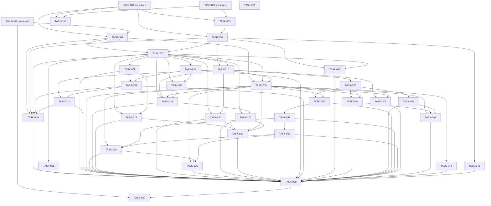

# English Tutoring Platform — Task Breakdown

Documentation reconciliation; implementation requires separately approved scope and applicable decisions.

## 1. Authority and Task/Status Rules

This plan reconciles implementation responsibilities for **Development of an English Tutoring Platform**. It does not authorize implementation or resolve open product decisions.

Authority: AGENTS.md -> PROJECT_SPEC.md -> REQUIREMENTS.md -> BUSINESS_RULES.md -> USE_CASES.md -> DOMAIN_MODEL.md -> ARCHITECTURE.md -> DATABASE_DESIGN.md -> API_DESIGN.md -> this document. All named documents are under docs/ except AGENTS.md. Apply the requirements-analysis, english-tutoring-domain, system-design and authentication-security project-local skills.

FEATURE_STATUS.md alone owns live implementation status and completion evidence. This document owns work, dependencies and acceptance boundaries. Planning readiness below is a snapshot: **TODO** means queued work can be refined around approved invariants; it does not mean its dependent contracts are approved. **DEFERRED** means the central implementation must await the named decision. **BLOCKED** would identify a concrete impediment preventing meaningful progress. These labels are not a second implementation ledger; DEFERRED is not a new live-status enum.

Only the three preserved foundation tasks have completed implementation evidence. No new task is marked complete or in progress. Before implementation, obtain scope approval, reconcile the status ledger where necessary, and check each applicable gate. Partial safe work never authorizes a gated remainder.

Preserve the modular monolith: Browser -> Next.js -> Spring Boot REST API -> JPA/Hibernate -> PostgreSQL. Preserve Java 17 and approved toolchain versions, local PostgreSQL support and Supabase development Session Pooler/TLS connectivity. Do not infer production hosting from development hosting. Spring Boot owns identity, roles, ownership, participation and payment effects. Authentication-specific security belongs in features/auth/security/.

STUDENT, TEACHER and ADMIN are authorization roles; participation and payment state are not roles. Public contracts use DTOs, never JPA entities. Do not introduce frontend database access, Supabase Auth/Data API/RLS authorization, supabase-js, Prisma or speculative infrastructure.

All pending implementation tasks inherit the following requirements:
- Use the task's source authority plus relevant DATABASE_DESIGN physical-readiness boundaries and API_DESIGN responsibility/contract gates.
- Obtain G-PHYSICAL resolution for executable V1 and approval for each later schema change,
  G-API approval for each exact wire contract, and G-UI approval for product interactions.
  Those gates do not require unrelated domain decisions.
- Implement backend authorization and negative tests with each feature; do not postpone them to release.
- Preserve required data without selecting global deletion, cascade, archive or retention policy.
- Record actual implementation files, verification results, remaining work and commit references when available in FEATURE_STATUS.md. Do not invent evidence or automatically rerun preserved infrastructure checks.

The task catalogue is workflow-based, not one task per endpoint or domain concept. No fixed
API/task total is inferred; the approved V1 physical direction now contains exactly 22
application tables.

## 2. Preserved Completed Foundations

The following are preserved **DONE facts**, not new verification performed by this rewrite. The detailed evidence and component statuses remain in FEATURE_STATUS.md. FEAT-001 is not declared complete; connectivity completion is not application-schema completion.

### TASK-001 — Backend technical foundation (preserved)

- Objective and authority: preserve the approved Spring Boot foundation; AGENTS.md Section 2 and ARCHITECTURE technical baseline.
- Completed evidence: Java 17 direction, Oracle JDK 17.0.12, Maven 3.9.16 and Maven Wrapper 3.3.4 only-script setup, including the recorded minimal Windows wrapper compatibility correction.
- Recorded verification: clean verify BUILD SUCCESS, Java release 17 compilation, one application-context test passed and executable JAR packaged.
- User-supplied ordinary Windows PowerShell evidence: the packaged JAR started with Oracle JDK 17.0.12, Tomcat bound 127.0.0.1:18080, "Started EnglishLearningApplication" appeared in 2.957 seconds and the process remained alive until manually stopped. That foundation verification required no database/external service.
- The recorded AF_UNIX/Selector failure was a Codex execution-environment limitation, not an application defect. Do not switch to Java 21 or change networking to work around it.
- Preservation boundary: later datasource configuration does not invalidate this historical result. Keep Java packages and artifact coordinates; do not recreate the foundation.
- Completion evidence: FEATURE_STATUS.md TASK-001 entry; no new evidence claimed here.

### TASK-002 — Frontend technical foundation (preserved)

- Objective and authority: preserve the Next.js/TypeScript technical shell and test foundation; ARCHITECTURE frontend baseline.
- Completed evidence: approved Node 24.21.0/npm 11.19.0 baseline, reproducible installation/lockfile, React Query provider foundation and dependency-only Zustand, with no speculative store.
- Recorded verification: npm ci, dependency inspection, typecheck, lint and production build passed. Neutral Playwright Chromium smoke tests passed 2/2 at narrow 390x844 and wide 1440x900 viewports without overflow/page errors.
- Development startup reached Ready/HTTP 200; shutdown evidence and the recorded keyboard-delivery limitation remain in the tracker. Preserve those qualifications.
- @playwright/test is browser E2E development tooling. It does not replace Spring Boot/JUnit/backend integration testing.
- Preservation boundary: technical responsiveness does not mean product UI/UX, navigation, authentication or API integration was approved or implemented.
- Completion evidence: FEATURE_STATUS.md TASK-002 entry; no new evidence claimed here.

### TASK-003 — PostgreSQL connectivity foundation (preserved)

- Objective and authority: preserve local/development datasource configuration, JPA/PostgreSQL connectivity and secrets protection; ARCHITECTURE data-access boundary.
- Completed evidence: environment-supplied DATABASE_URL, DATABASE_USERNAME and DATABASE_PASSWORD; ddl-auto: none and SQL initialization disabled. Flyway was not installed and no application schema was created.
- Recorded verification: Java 17/Maven 3.9.16 clean verify succeeded; one context test passed and the opt-in connectivity test was skipped without live configuration. Missing configuration and controlled unreachable-endpoint failures were checked.
- User-supplied verification: DatabaseConnectivityTests passed once against local PostgreSQL 18.6 and once against Supabase PostgreSQL 17.6, each with BUILD SUCCESS. Supabase used Session Pooler port 5432 with sslmode=require; credentials were privately supplied.
- User-supplied no-mutation/TLS evidence: subsequent psql negotiated TLSv1.3 and reported no visible tables. This is the recorded observation, not a fresh inspection of the database or a claim about provider-internal objects.
- User-supplied configured Spring startup: EntityManagerFactory initialized, Tomcat started on 8080, "Started EnglishLearningApplication" appeared in 4.416 seconds, and graceful EntityManagerFactory/Hikari shutdown completed with BUILD SUCCESS.
- Preservation boundary: keep Session Pooler/TLS and ignored-local/environment secret conventions. No new credentials or database reconnection is needed for this rewrite.
- Completion evidence: FEATURE_STATUS.md TASK-003 entry. Its persistence component evidence covers connectivity, not migrations, entities or the whole domain schema.

## 3. Documentation Reconciliation

Current tracking/onboarding documents are reconciled; TASK-031's completion evidence remains
in FEATURE_STATUS.md. New physical decisions update only affected guidance and do not
advance implementation.

### TASK-031 — Reconcile downstream tracking and operational guidance

- **Planning readiness:** TODO; decision gates below remain binding.
- **Objective:** Align downstream documentation without turning planning into completed implementation.
- **Source authority:** AGENTS.md Sections 2, 3 and 20; AR-017; current task catalogue and README/FEATURE_STATUS downstream audit.
- **Prerequisites:** No implementation prerequisite; separate documentation approval is required.
- **Decision gates:** No new product decision; preserve existing open gates.
- **Allowed scope:** Under separate approval, reconcile FEATURE_STATUS task/feature mappings and README scope/setup descriptions; preserve completed evidence and technical names.
- **Forbidden scope:** No implementation, reinstallation, credentials, automatic status promotion or product decisions.
- **Expected areas:** Documentation and evidence review only.
- **Acceptance:** Every active/retired task has an unambiguous tracker disposition; preserved TASK-001/002/003 evidence and unfinished foundation components remain truthful.
- **Negative acceptance:** Reject any proposed rename of packages, artifacts or databases based solely on the product title; do not rewrite historical evidence as newly run tests.
- **Verification:** Review source mappings, identifiers, document diff and unchanged infrastructure evidence.
- **Completion evidence:** Record actual files, checks, remaining work and available commit references in FEATURE_STATUS.md under TASK-031; no evidence is claimed here.

## 4. Authentication and Identity

### TASK-004 — Physical Database V1 migration and persistence integrity

- **Planning readiness:** TODO; G-PHYSICAL is RESOLVED; explicit implementation approval is still required.
- **Objective:** Establish the separately approved Physical Database V1 migration and
  persistence-integrity foundation under the resolved physical design and separate implementation approval.
- **Source authority:** NFR-DATA-006; AR-009, AR-016; DATABASE_DESIGN physical-design readiness; ARCHITECTURE data-access boundary.
- **Prerequisites:** TASK-001, TASK-003.
- **Decision gates:** G-PHYSICAL.
- **Allowed scope:** After G-PHYSICAL resolution and explicit implementation approval, add
  Flyway and the corrected 22-table V1 with approved keys/constraints/indexes; no schema
  execution is authorized by this documentation.
- **Forbidden scope:** No unresolved provider fields/uniqueness scopes or unsupported
  physical restrictions in executable V1; no automatic schema mutation, global soft delete
  or speculative tables.
- **Expected areas:** Backend persistence configuration, migrations and database integration tests; no product UI.
- **Acceptance:** The finalized approved V1 applies reproducibly to isolated PostgreSQL and
  repeated validation is safe; constraints and transactional test responsibilities match the
  approved design.
- **Negative acceptance:** Invalid data is rejected by approved constraints; failed/repeated migration verification does not silently mutate unrelated data. No live development database is used destructively.
- **Verification:** Review approved physical design; test clean application and repeat validation on isolated PostgreSQL; verify ddl-auto/SQL-init protections and secret handling.
- **Completion evidence:** Record actual files, checks, remaining work and available commit references in FEATURE_STATUS.md under TASK-004; no evidence is claimed here.

### TASK-005 — Shared API and client boundary conventions

- **Planning readiness:** TODO; decision gates below remain binding.
- **Objective:** Establish only shared conventions needed by the first approved use-case slice.
- **Source authority:** NFR-MNT-001, NFR-MNT-002, NFR-MNT-008, NFR-MNT-010; AR-003, AR-004, AR-005, AR-013; API_DESIGN Sections 2, 19 and 20.
- **Prerequisites:** TASK-001, TASK-002.
- **Decision gates:** G-API, G-UI.
- **Allowed scope:** DTO mapping, input/error handling and proportionate frontend request handling around approved contracts; /api/v1 direction, lossless identifiers/money with currency and ISO-8601 time representation.
- **Forbidden scope:** No claim that the API catalogue is final; no speculative generic CRUD, arbitrary JSON to evade decisions, automatic mutation retries or fixed pagination/error policy without approval.
- **Expected areas:** Backend HTTP/DTO boundaries, frontend client foundation and contract tests; no domain schema.
- **Acceptance:** The first approved request/response and error case use consistent conventions without exposing entities; money/identifier round trips lose no precision.
- **Negative acceptance:** Invalid input and unexpected protected fields follow approved rejection semantics; errors/logs reveal no credentials, stack internals or private records.
- **Verification:** Serialization, validation and error tests; frontend typecheck/lint/build when client code changes; review exact contract decisions.
- **Completion evidence:** Record actual files, checks, remaining work and available commit references in FEATURE_STATUS.md under TASK-005; no evidence is claimed here.

### TASK-006 — Authentication and backend authorization foundation

- **Planning readiness:** TODO; decision gates below remain binding.
- **Objective:** Provide Spring Security/JWT identity and explicit role/account eligibility enforcement.
- **Source authority:** FR-ACC-001, FR-ACC-002, FR-AUTH-001, FR-AUTH-006, FR-AUTH-007, FR-AUTH-009; NFR-SEC-001, NFR-SEC-010, NFR-SEC-016, NFR-SEC-017; BR-ROLE-001, BR-AUTHN-017, BR-AUTHN-020, BR-AUTHN-023; DM-USER-002; INV-001, INV-023; AR-006; API_DESIGN Sections 3 and 4.
- **Prerequisites:** TASK-001, TASK-005.
- **Decision gates:** G-TOKEN, G-SECURITY, G-ADMIN, G-API.
- **Allowed scope:** Approved password facilities, validated principal resolution and reusable enforcement at real feature boundaries; authentication security under features/auth/security/.
- **Forbidden scope:** No client-authoritative roles, full-domain-schema prerequisite, generalized RBAC, invented Admin provisioning or assumed token/cookie/signing policy.
- **Expected areas:** Backend authentication/security, unit and security integration tests; browser transport only after approval.
- **Acceptance:** For an approved eligible principal, a permitted operation succeeds; invalid/expired credentials, restricted accounts and wrong roles cannot reach protected work.
- **Negative acceptance:** Forged roles or identity claims cannot override authenticated identity; sensitive JWT claims, password/token hashes and keys never enter public DTOs/logs.
- **Verification:** Test authorized and denied role/account cases, expiry/signature
  validation and redaction. Persistence integration uses the approved TASK-004 schema when
  needed; security test preparation need not wait for unrelated domain implementation.
- **Completion evidence:** Record actual files, checks, remaining work and available commit references in FEATURE_STATUS.md under TASK-006; no evidence is claimed here.

### TASK-007 — Student registration and shared authentication sessions

- **Planning readiness:** TODO; decision gates below remain binding.
- **Objective:** Deliver Student registration, email verification/resend and shared login/refresh/logout with server-side RefreshSession authority.
- **Source authority:** FR-STU-001, FR-STU-002, FR-STU-003, FR-TEA-001, FR-ADM-001, FR-ACC-003, FR-ACC-004, FR-ACC-005, FR-ACC-006, FR-ACC-008, FR-ACC-009, FR-ACC-014, FR-ACC-015, FR-ACC-016; BR-AUTHN-002, BR-AUTHN-006, BR-AUTHN-007, BR-AUTHN-008, BR-AUTHN-009, BR-AUTHN-010, BR-AUTHN-011, BR-AUTHN-018, BR-AUTHN-019; DM-USER-001, DM-AUTH-001, DM-AUTH-002; UC-AUTH-REGISTER-01, UC-AUTH-VERIFY-EMAIL-01, UC-AUTH-LOGIN-01, UC-AUTH-REFRESH-01, UC-AUTH-LOGOUT-01; API_DESIGN Section 3.
- **Prerequisites:** TASK-004, TASK-006.
- **Decision gates:** G-TOKEN, G-SECURITY, G-EMAIL, G-PROFILE, G-API, G-UI, G-PHYSICAL.
- **Allowed scope:** Implement approved credential validation, rotation/invalidation requirements and account checks; honor documented configurable lifetimes without deciding unresolved security details.
- **Forbidden scope:** No automatic Teacher approval, unrestricted role selection, new registration fields or universal activation/revocation policy inferred from verification/logout.
- **Expected areas:** Backend auth services/repositories/DTOs, minimal approved persistence, frontend auth flows and tests.
- **Acceptance:** An eligible account completes approved registration/verification and login; a valid refresh creates permitted authentication and logout invalidates the applicable refresh authority.
- **Negative acceptance:** Invalid, expired or revoked credentials cannot authenticate; verification does not independently approve a Teacher; protected state is unchanged on rejected refresh/verification.
- **Verification:** JUnit service/security and persistence tests for success, replay/expiry and restriction; browser tests only for approved transport and UI, using controlled email delivery.
- **Completion evidence:** Record actual files, checks, remaining work and available commit references in FEATURE_STATUS.md under TASK-007; no evidence is claimed here.

### TASK-008 — Dedicated password change and recovery

- **Planning readiness:** TODO; decision gates below remain binding.
- **Objective:** Implement dedicated security workflows for changing and recovering a password.
- **Source authority:** FR-ACC-010, FR-ACC-011, FR-ACC-012, FR-ACC-013; NFR-SEC-014; BR-AUTHN-013, BR-AUTHN-014, BR-AUTHN-015, BR-AUTHN-016; DM-AUTH-003; UC-AUTH-CHANGE-PASSWORD-01, UC-AUTH-FORGOT-PASSWORD-01, UC-AUTH-RESET-PASSWORD-01; API_DESIGN Section 3.
- **Prerequisites:** TASK-007.
- **Decision gates:** G-TOKEN, G-SECURITY, G-EMAIL, G-API, G-UI, G-PHYSICAL.
- **Allowed scope:** Dedicated password change/recovery: reset revokes all refresh sessions;
  logged-in change revokes others while preserving current. Retain privacy and expiry
  safeguards.
- **Forbidden scope:** No password update via ordinary profile, new password policy, guessed token invalidation scope or selected email provider without approval.
- **Expected areas:** Backend security/persistence, frontend approved forms and unit/integration/browser tests.
- **Acceptance:** An authorized change or valid reset changes the intended account credential under approved policy; recovery responses preserve documented account privacy.
- **Negative acceptance:** Expired, invalid or replayed reset credentials and another User identity cannot change a password; rejected requests leave credentials unchanged and never expose tokens/hashes.
- **Verification:** Test reset lifetime, replay rejection, authorization and privacy; browser coverage stays separate from backend security verification.
- **Completion evidence:** Record actual files, checks, remaining work and available commit references in FEATURE_STATUS.md under TASK-008; no evidence is claimed here.

### TASK-032 — Teacher registration and controlled onboarding

- **Planning readiness:** DEFERRED; decision gates below remain binding.
- **Objective:** Support approved Teacher registration without inventing approval or activation policy.
- **Source authority:** FR-TEA-005; BR-AUTHN-024; UC-AUTH-REGISTER-TEACHER-01; DM-USER-001, DM-USER-002, DM-TEA-001; API_DESIGN Section 3.
- **Prerequisites:** TASK-007.
- **Decision gates:** G-TEACHER, G-SECURITY, G-EMAIL, G-PROFILE, G-API, G-UI, G-PHYSICAL.
- **Allowed scope:** Separate Teacher registration, hashed verification and retained
  PENDING/APPROVED/REJECTED application snapshots; current profile after approval. Business
  authority requires TEACHER, verified, unlocked and approved.
- **Forbidden scope:** No separate Teacher login identity, unrestricted TEACHER self-assignment, automatic eligibility after email verification or replacement mandatory Admin-provisioning workflow.
- **Expected areas:** Backend onboarding/security, minimum persistence, frontend approved onboarding and tests.
- **Acceptance:** Approved review flow preserves snapshots and at most one PENDING
  application; verified role alone cannot grant Teacher business authority.
- **Negative acceptance:** Unapproved/ineligible accounts cannot manage Courses merely by selecting TEACHER or completing an unrelated verification step; rejected input cannot escalate privileges.
- **Verification:** Exercise each approved onboarding transition and denial case with backend tests and approved browser flows.
- **Completion evidence:** Record actual files, checks, remaining work and available commit references in FEATURE_STATUS.md under TASK-032; no evidence is claimed here.

## 5. User and Teacher Profile

### TASK-009 — Current account and own personal profile

- **Planning readiness:** TODO; decision gates below remain binding.
- **Objective:** Expose safe current-account information and approved Student/Teacher self-profile changes.
- **Source authority:** FR-ACC-007, FR-STU-004, FR-STU-005; BR-AUTHN-012, BR-PROFILE-002; DM-USER-001; UC-AUTH-ME-01, UC-AUTH-PROFILE-01; API_DESIGN Sections 3 and 6.
- **Prerequisites:** TASK-007.
- **Decision gates:** G-PROFILE, G-API, G-UI, G-PHYSICAL.
- **Allowed scope:** Resolve the authenticated User; implement only the subsequently approved editable fields and update/null semantics.
- **Forbidden scope:** No exhaustive legacy field schema, independent identity, arbitrary role/status/email/password mutation or newly granted Admin self-edit capability.
- **Expected areas:** Backend DTO/service/persistence, frontend profile view/edit and tests.
- **Acceptance:** An eligible Student/Teacher reads and updates only their own approved profile data; account and public projections remain distinct.
- **Negative acceptance:** Forged studentId/user identity or protected properties cannot edit another account or security-controlled state; invalid updates do not partly mutate the record.
- **Verification:** Test principal-based ownership, field allowlisting, approved validation/null behavior and private-field redaction; browser tests for approved profile interactions.
- **Completion evidence:** Record actual files, checks, remaining work and available commit references in FEATURE_STATUS.md under TASK-009; no evidence is claimed here.

### TASK-033 — Teacher teaching profile and public projection

- **Planning readiness:** TODO; decision gates below remain binding.
- **Objective:** Manage a Teacher own teaching information and a separate safe public projection.
- **Source authority:** FR-TEA-002, FR-TEA-003, FR-DIS-004; BR-PROFILE-002, BR-AUTH-007; DM-TEA-001; UC-AUTH-PROFILE-01, UC-DIS-TEACHERS-01; API_DESIGN Sections 5 and 6.
- **Prerequisites:** TASK-009, TASK-032.
- **Decision gates:** G-PROFILE, G-TEACHER, G-DISCOVERY, G-API, G-UI, G-PHYSICAL, G-FILES.
- **Allowed scope:** Current specialization/experience/introduction and avatar Storage path,
  separate from retained application snapshots; exact editable/public DTO remains gated.
- **Forbidden scope:** No second login identity, application-snapshot mutation through
  profile edit or private bank information in public projection.
- **Expected areas:** Backend profile/query projections and minimum persistence, frontend own/public views and tests.
- **Acceptance:** An eligible Teacher manages their own approved teaching fields and public readers see only the approved public projection.
- **Negative acceptance:** Teacher A cannot update Teacher B; public responses exclude receiving information, account-security data and private student/payment information.
- **Verification:** Test own-profile updates, wrong-owner denial and public/private DTO serialization; responsive browser checks after UI approval.
- **Completion evidence:** Record actual files, checks, remaining work and available commit references in FEATURE_STATUS.md under TASK-033; no evidence is claimed here.

### TASK-046 — Teacher certificate persistence and management

- **Planning readiness:** TODO; only documentation and V2 preparation are currently authorized.
- **Objective:** Support multiple Teacher-owned certificates, Admin verification and VERIFIED-only public-profile visibility.
- **Source authority:** FR-CERT-001, FR-CERT-002, FR-CERT-003; BR-CERT-001, BR-CERT-002, BR-CERT-003; UC-CERT-OWN-01, UC-CERT-REVIEW-01, UC-CERT-PUBLIC-01; DM-CERT-001; DATABASE_DESIGN Section 26; API_DESIGN Section 6.
- **Prerequisites:** TASK-004 for additive migration; TASK-006, TASK-007, TASK-033 and TASK-011 for full application integration.
- **Decision gates:** G-API, G-UI, G-FILES, G-PROFILE, G-DISCOVERY; approved Admin review authority is bounded to certificates. Exact review concurrency/validation remains open.
- **Allowed scope:** Prepare additive V2 without changing V1; separately approved deployment and later own add/list/delete/replace, Admin pending review/verify/reject and public VERIFIED-only reads.
- **Forbidden scope:** No certificate types/categories, issuer, issue/expiry dates, scores, self-verification, Teacher onboarding effects, migration execution without approval or merging into TASK-005.
- **Expected areas:** Additive migration, later Teacher feature persistence/DTO/services and authorized evidence integration, Teacher/Admin/public frontend and tests.
- **Acceptance:** V2 preserves V1/data and creates only the seven-column child table; an eligible Teacher manages only own certificates; Admin reviews current pending evidence; replacement resets PENDING; public reads/delivery never expose pending/rejected evidence.
- **Negative acceptance:** Wrong-owner/role, forged status/owner and stale review fail without protected disclosure or unauthorized changes. Rejected records cannot appear verified.
- **Verification:** Static SQL/FK/naming checks now; isolated migration/repeat-validation tests only under later approval; later backend ownership/lifecycle/concurrency/redaction and approved frontend/browser checks.
- **Completion evidence:** FEATURE_STATUS.md owns actual evidence/status. Prepared migration is not deployed schema or completed feature. This scope does not complete TASK-005; preserve completed TASK-001 through TASK-004 evidence.

## 6. Public Discovery

### TASK-011 — Public Teacher and Course discovery

- **Planning readiness:** TODO; decision gates below remain binding.
- **Objective:** Provide safe Teacher/Course search, filtering and public details independently of protected participation.
- **Source authority:** FR-DIS-003, FR-DIS-004, FR-DIS-005, FR-DIS-006, FR-AUTH-012; NFR-PERF-004; BR-AUTH-007, BR-ENR-007; UC-DIS-TEACHERS-01, UC-STU-BROWSE-COURSES-01, UC-STU-VIEW-COURSE-01; API_DESIGN Section 5.
- **Prerequisites:** TASK-010, TASK-033.
- **Decision gates:** G-DISCOVERY, G-COURSE, G-API, G-UI, G-CATEGORY.
- **Allowed scope:** Approved public Teacher information and Course name, description, owner, tuition, schedule and Session count where applicable; category filtering integrates TASK-034 when approved.
- **Forbidden scope:** No prerequisite on Session implementation, Assignments, Enrollment or Payment; no protected content merely to populate discovery. Do not invent search/publication/filter/sort rules.
- **Expected areas:** Backend public query DTOs, frontend discovery and tests; indexes only from approved queries/physical design.
- **Acceptance:** A public visitor can find/view eligible Teachers and Courses through approved query semantics; unavailable optional summaries are handled by the approved contract.
- **Negative acceptance:** Public responses never disclose Meet URLs, receiving details, submissions/results, transactions/evidence or authentication/session data; query manipulation does not bypass visibility.
- **Verification:** Test public projections and query validation; responsive discovery checks using approved UI, without requiring protected feature implementation.
- **Completion evidence:** Record actual files, checks, remaining work and available commit references in FEATURE_STATUS.md under TASK-011; no evidence is claimed here.

## 7. Course Management

### TASK-010 — Teacher-owned Course management

- **Planning readiness:** TODO; decision gates below remain binding.
- **Objective:** Let an eligible Teacher create/manage multiple owned Courses and publish under approved lifecycle policy.
- **Source authority:** FR-TCR-001, FR-TCR-003, FR-TCR-004, FR-TCR-005, FR-TCR-006, FR-TCR-007, FR-TCR-008, FR-TCR-009; BR-COURSE-001, BR-COURSE-002, BR-COURSE-003, BR-COURSE-004, BR-COURSE-007, BR-AUTH-003; DM-COURSE-001; INV-002; UC-TEA-COURSE-01, UC-TEA-PUBLISH-01; AR-015; API_DESIGN Section 7.
- **Prerequisites:** TASK-006, TASK-007.
- **Decision gates:** G-TEACHER, G-COURSE, G-MONEY, G-API, G-UI, G-PHYSICAL, G-CATEGORY,
  G-CAPACITY, G-FILES.
- **Allowed scope:** Non-transferable Teacher owner, exactly one Category, approved
  five-state lifecycle, tuition/discount snapshots and capacity direction. Concrete
  scheduling belongs to TASK-037.
- **Forbidden scope:** No client-controlled ownership transfer, unsupported lifecycle
  transitions or invented publication/completion policy. Apply the approved VND, discount
  and Meet publication rules; remaining operation validation stays gated.
- **Expected areas:** Backend Course use cases and minimal persistence, frontend owned-Course management, ownership tests.
- **Acceptance:** Given an eligible Teacher, permitted creation binds that Teacher as owner; approved edits affect only owned Courses and publication follows its approved prerequisites.
- **Negative acceptance:** Teacher A cannot read private management data or mutate Teacher B Course; forged ownership or protected properties cannot transfer ownership; rejected edits leave state unchanged.
- **Verification:** Service/persistence/security tests for ownership and approved lifecycle, money validation and category references; responsive management checks after contract/UI approval. TASK-032 is needed for end-to-end Teacher onboarding, not to test ownership with approved test identities.
- **Completion evidence:** Record actual files, checks, remaining work and available commit references in FEATURE_STATUS.md under TASK-010; no evidence is claimed here.

## 8. Categories / Topics

### TASK-034 — Admin category/topic management and Teacher selection

- **Planning readiness:** TODO; decision gates below remain binding.
- **Objective:** Provide Admin-managed teaching categories/topics for appropriate Course selection and discovery.
- **Source authority:** FR-ADM-007; BR-ADM-001; DM-CAT-001; UC-ADM-CATEGORIES-01; API_DESIGN Section 8.
- **Prerequisites:** TASK-006, TASK-007.
- **Decision gates:** G-CATEGORY, G-ADMIN, G-API, G-UI, G-PHYSICAL.
- **Allowed scope:** Admin active/inactive Categories, exactly one per Course;
  retain/deactivate used Categories. Integrate Course binding/discovery through approved
  contracts.
- **Forbidden scope:** No hierarchy, automatic reassignment, deletion of used Categories or
  authority over Course ownership.
- **Expected areas:** Backend taxonomy/validation and approved persistence, Admin/Teacher frontend controls and tests.
- **Acceptance:** An authorized Admin performs approved category operations; an eligible Teacher selects only permitted category/topic values for their own Course.
- **Negative acceptance:** Non-Admins cannot manage taxonomy; invalid selections and prohibited deletion/reassignment leave Course/category state unchanged.
- **Verification:** Test role restrictions and approved selection/in-use behavior; review query visibility and browser controls without substituting UI checks for backend authorization.
- **Completion evidence:** Record actual files, checks, remaining work and available commit references in FEATURE_STATUS.md under TASK-034; no evidence is claimed here.

## 9. Enrollment and Participation

### TASK-016 — Whole-Course Enrollment and participation authorization

- **Planning readiness:** TODO; decision gates below remain binding.
- **Objective:** Represent Student participation in an entire Course and enforce authoritative protected access.
- **Source authority:** FR-ENR-004, FR-ENR-006, FR-ENR-007, FR-ENR-008, FR-TCR-010, FR-ADM-008; BR-ENR-001, BR-ENR-006, BR-ENR-007, BR-ENR-008, BR-TEA-003; DM-ENR-001; INV-013, INV-014; UC-STU-ENROLL-01, UC-STU-MY-COURSES-01, UC-TEA-STUDENTS-01, UC-ADM-ENROLLMENTS-01; AR-018; API_DESIGN Section 12.
- **Prerequisites:** TASK-004, TASK-007, TASK-010.
- **Decision gates:** G-ENROLLMENT, G-CAPACITY, G-PAYEFFECT, G-ADMIN, G-API, G-UI, G-PHYSICAL.
- **Allowed scope:** Unique Student/Course Enrollment, PENDING/ACTIVE/COMPLETED/CANCELLED;
  free activation without Payment. Capacity includes ACTIVE plus unexpired reserved PENDING,
  minimum counts ACTIVE. Enforce first-Session cutoff and concurrency.
- **Forbidden scope:** No completed-record re-enrollment into same instance, expired-seat
  occupancy, browser-authoritative access or unconditional late-payment activation.
- **Expected areas:** Backend participation service/queries and approved persistence; Student, Teacher and Admin views; authorization tests.
- **Acceptance:** A Student sees only their own Course relationships; protected access requires backend-approved participation. Teacher visibility traverses the owned Course; Admin gets only approved monitoring.
- **Negative acceptance:** Forged studentId, another Student relationship or mere public discovery cannot grant access. Rejected/duplicate/capacity cases follow approved policy and cannot silently activate access.
- **Verification:** Test role/identity/resource access and state preservation; add approved lifecycle/capacity concurrency checks after decisions. TASK-022 integrates payment effects later; it is not this task prerequisite.
- **Completion evidence:** Record actual files, checks, remaining work and available commit references in FEATURE_STATUS.md under TASK-016; no evidence is claimed here.

## 10. Sessions and Scheduling

### TASK-035 — Teacher management of Course Sessions

- **Planning readiness:** TODO; decision gates below remain binding.
- **Objective:** Manage Sessions under an owned Course using approved Session contracts.
- **Source authority:** FR-SES-001, FR-SES-002; BR-SES-001, BR-SES-002, BR-TEA-001; DM-SES-001; INV-017; UC-SES-MANAGE-01; API_DESIGN Section 9.
- **Prerequisites:** TASK-010.
- **Decision gates:** G-TIME, G-SESSION, G-API, G-UI, G-PHYSICAL.
- **Allowed scope:** Nullable protected Session content and SCHEDULED/CANCELLED lifecycle
  under nested ownership; preserve Session identity/number/count and cancellation history.
- **Forbidden scope:** No public learning-content exposure, RESCHEDULED status, attendance
  or replacement/make-up Sessions. Recurrence implementation belongs to TASK-037.
- **Expected areas:** Backend Session service/persistence, Teacher management UI and nested ownership tests.
- **Acceptance:** An eligible owning Teacher manages a Session under its actual Course; approved time/content validation is enforced.
- **Negative acceptance:** Teacher A cannot mutate Teacher B Session by changing a route Course ID or payload parent; rejected reparenting/content/time requests leave the resource unchanged.
- **Verification:** Test parent traversal and mismatched nested IDs; implement approved date/time cases only. Student protected reading is TASK-036 and recurrence is TASK-037.
- **Completion evidence:** Record actual files, checks, remaining work and available commit references in FEATURE_STATUS.md under TASK-035; no evidence is claimed here.

### TASK-036 — Protected Student Session and content access

- **Planning readiness:** TODO; decision gates below remain binding.
- **Objective:** Expose Course Sessions/content to appropriately authorized Students.
- **Source authority:** FR-SES-003; BR-ENR-006, BR-SES-001; INV-013, INV-023; UC-SES-VIEW-01; API_DESIGN Section 9.
- **Prerequisites:** TASK-035, TASK-016.
- **Decision gates:** G-ENROLLMENT, G-SESSION, G-API, G-UI.
- **Allowed scope:** Student reads bound to backend participation in the actual Course; explicit protected DTOs.
- **Forbidden scope:** No public content expansion, forged Course/Enrollment IDs, inferred lifetime access or duplicated Meet configuration.
- **Expected areas:** Backend read authorization/projections, Student responsive views and tests; reuse approved Session persistence.
- **Acceptance:** A Student with approved participation accesses permitted Sessions/content in the corresponding Course.
- **Negative acceptance:** An unrelated/nonparticipating Student cannot fetch protected content via a direct child ID or nested-route mismatch; refusal discloses no content or other Student data.
- **Verification:** Test participating/nonparticipating and mismatched-parent cases; browser checks verify approved narrow/wide rendering and denial handling.
- **Completion evidence:** Record actual files, checks, remaining work and available commit references in FEATURE_STATUS.md under TASK-036; no evidence is claimed here.

### TASK-037 — Recurring Course schedule and individual Session adjustments

- **Planning readiness:** DEFERRED; decision gates below remain binding.
- **Objective:** Represent approved Course recurrence and individual occurrence adjustments as distinct responsibilities.
- **Source authority:** FR-SCH-001, FR-SCH-002; BR-SCH-001; DM-SCH-001; INV-020; UC-SCH-COURSE-01, UC-SCH-SESSION-01; API_DESIGN Section 9.
- **Prerequisites:** TASK-035.
- **Decision gates:** G-TIME, G-RECURRENCE, G-SESSION, G-API, G-UI, G-PHYSICAL.
- **Allowed scope:** Weekly rules generate concrete Sessions before publication; reschedule
  same Session with old/new history; generate fixed unique numbering from ISO weekly
  rules and IANA timezone, preserve cancelled rows/count and synchronize Calendar effects.
- **Forbidden scope:** No generalized scheduling engine, invented DST/cutoff
  policy or rollback of Session changes on Calendar failure; Calendar integration belongs to
  TASK-043.
- **Expected areas:** Backend schedule/Session logic and selected persistence, Teacher schedule UI, time-boundary tests.
- **Acceptance:** An owner performs an approved individual adjustment without necessarily changing the recurring Course schedule; approved generation/time semantics are demonstrable.
- **Negative acceptance:** Another Teacher cannot reschedule; rejected conflicts/invalid times leave affected schedules and Sessions unchanged under the approved policy.
- **Verification:** Test timezone/boundary and exception cases selected by the approved policy, including individual-versus-recurring effects; Calendar remains separate.
- **Completion evidence:** Record actual files, checks, remaining work and available commit references in FEATURE_STATUS.md under TASK-037; no evidence is claimed here.

## 11. Assignments

### TASK-038 — Session Assignment management and authorized viewing

- **Planning readiness:** TODO; decision gates below remain binding.
- **Objective:** Provide Teacher-managed Assignments within Sessions and protected Student viewing.
- **Source authority:** FR-SES-004, FR-ASN-001, FR-ASN-002, FR-ASN-003; BR-ASN-001; DM-ASN-001; INV-017; UC-ASN-MANAGE-01, UC-ASN-VIEW-01; API_DESIGN Section 10.
- **Prerequisites:** TASK-035, TASK-016.
- **Decision gates:** G-ASSIGNMENT, G-FILES, G-API, G-UI, G-PHYSICAL.
- **Allowed scope:** ACTIVE/CANCELLED Assignments, nested ownership/access and authorized
  Storage attachments; no hard deletion after any Submission.
- **Forbidden scope:** No guessed mandatory-deadline/score ceiling or automatic assessment
  engine; file limits require approved contracts.
- **Expected areas:** Backend management/read authorization, approved persistence, Teacher/Student interfaces and tests.
- **Acceptance:** An owning Teacher manages an Assignment in the correct Session; an authorized Student sees permitted Assignment content.
- **Negative acceptance:** Wrong-owner Teachers and unrelated Students cannot read/mutate protected Assignment resources; forged parent IDs cannot bypass traversal.
- **Verification:** Test approved content validation, ownership, parent mismatch and participation; frontend checks only for approved formats/interactions.
- **Completion evidence:** Record actual files, checks, remaining work and available commit references in FEATURE_STATUS.md under TASK-038; no evidence is claimed here.

## 12. Submissions and Results

### TASK-039 — Student Assignment Submission

- **Planning readiness:** TODO; decision gates below remain binding.
- **Objective:** Persist authorized Student work against an Assignment with authenticated authorship.
- **Source authority:** FR-ASN-004; BR-ASN-002; DM-ASN-002; INV-018; UC-ASN-SUBMIT-01; API_DESIGN Section 11.
- **Prerequisites:** TASK-038.
- **Decision gates:** G-SUBMISSION, G-ASSIGNMENT, G-FILES, G-API, G-UI, G-PHYSICAL.
- **Allowed scope:** One current Student/Assignment Submission with DRAFT/SUBMITTED/GRADED;
  authenticated authorship and Enrollment; authorized Storage attachments.
- **Forbidden scope:** No revision-history table, guessed retry/resubmission policy or
  automatic scoring.
- **Expected areas:** Backend submission transaction/persistence, Student submission UI and security/integration tests.
- **Acceptance:** An eligible participating Student submits permitted work for the actual Assignment and sees their own authorized Submission.
- **Negative acceptance:** Forged studentId, wrong Course/Assignment, another Student record or unauthorized retry cannot create/replace protected work; denial leaves existing submissions unchanged.
- **Verification:** Test author identity, participation, wrong-parent and approved duplicate/resubmission cases; verify rejected requests do not overwrite work and browser retries follow the approved contract.
- **Completion evidence:** Record actual files, checks, remaining work and available commit references in FEATURE_STATUS.md under TASK-039; no evidence is claimed here.

### TASK-040 — Owned-Course Submission inspection and Student result visibility

- **Planning readiness:** TODO; decision gates below remain binding.
- **Objective:** Allow an owning Teacher to inspect authorized submissions/results and a Student to see their own available result.
- **Source authority:** FR-ASN-005, FR-ASN-006; BR-ASN-003; DM-ASN-003; INV-018; UC-ASN-INSPECT-01, UC-ASN-RESULT-01; API_DESIGN Section 11.
- **Prerequisites:** TASK-039.
- **Decision gates:** G-RESULT, G-SUBMISSION, G-FILES, G-API, G-UI, G-PHYSICAL.
- **Allowed scope:** Owned-Course inspection and owning-Teacher grading on Submission, with
  required time/grader evidence; score bounded by Assignment max_score; Student own-result
  projection.
- **Forbidden scope:** No separate result/grading table, mandatory numeric score solely from
  GRADED, cross-owner grading or fabricated zero results.
- **Expected areas:** Backend authorized projections and approved result representation; Teacher/Student views; privacy tests.
- **Acceptance:** Teacher inspection is limited to owned Courses; a Student receives only their own permitted result or the approved unavailable-result response.
- **Negative acceptance:** Teacher A cannot inspect Teacher B private submissions; Student A cannot read Student B Submission/Result; Admin role alone grants no grader access.
- **Verification:** Use approved fixtures to test nested ownership, cross-Student privacy and unavailable results; later test only explicitly approved grading/result behavior.
- **Completion evidence:** Record actual files, checks, remaining work and available commit references in FEATURE_STATUS.md under TASK-040; no evidence is claimed here.

## 13. Course Progress

### TASK-018 — CourseProgress and own learning-progress visibility

- **Planning readiness:** DEFERRED; decision gates below remain binding.
- **Objective:** Provide current CourseProgress after its meaning and source evidence are approved.
- **Source authority:** FR-PRO-004, FR-PRO-009, FR-ENR-005; BR-AUTH-006; DM-PRO-002; UC-LEARN-PROGRESS-01; API_DESIGN Section 13.
- **Prerequisites:** TASK-016, TASK-039, TASK-040.
- **Decision gates:** G-PROGRESS, G-RESULT, G-API, G-UI, G-PHYSICAL.
- **Allowed scope:** Derived authorized progress projection from approved source evidence;
  formulas still require approval.
- **Forbidden scope:** No progress/attendance/statistics table, guessed formula or
  fabricated progress.
- **Expected areas:** Backend approved calculation/query and optional approved persistence, Student progress view and tests.
- **Acceptance:** For the same approved evidence, progress has the approved reproducible meaning and is visible only to the entitled Student/authorized owner.
- **Negative acceptance:** Another Student cannot view private progress; missing evidence is not silently counted as completion or failure; rejected access leaves source data unchanged.
- **Verification:** Test approved calculation examples and boundary cases, own-record visibility and source updates; revise conditional source dependencies if the approved model selects different inputs.
- **Completion evidence:** Record actual files, checks, remaining work and available commit references in FEATURE_STATUS.md under TASK-018; no evidence is claimed here.

## 14. Payment Receiving Information

### TASK-041 — Private Teacher PaymentReceivingInformation

- **Planning readiness:** DEFERRED; decision gates below remain binding.
- **Objective:** Manage private Teacher receiving configuration using the subsequently approved representation.
- **Source authority:** FR-PAY-007; BR-PAY-006, BR-PAY-007; DM-PAY-002; INV-015; UC-PAY-RECEIVING-01; AR-019; API_DESIGN Section 14.
- **Prerequisites:** TASK-007, TASK-032.
- **Decision gates:** G-RECEIVING, G-PAYMENT, G-API, G-UI, G-PHYSICAL.
- **Allowed scope:** Private historical Teacher bank accounts, at most one ACTIVE, retaining
  historical Payment account references; verify conceptual provider fields before migration.
- **Forbidden scope:** No invented VietQR API fields, public bank disclosure or
  client-authoritative destination.
- **Expected areas:** Backend private configuration/security and approved persistence; Teacher private view and tests.
- **Acceptance:** An eligible Teacher manages only their approved receiving information; Course payment resolution uses the actual owner and approved destination selection.
- **Negative acceptance:** Another Teacher, public visitor or client-supplied recipient/destination cannot replace the authoritative destination; rejection leaves private configuration unchanged.
- **Verification:** Test own/wrong-owner access, receiving selection using approved fixtures and absence from public Teacher/Course DTOs. Do not require live transfers.
- **Completion evidence:** Record actual files, checks, remaining work and available commit references in FEATURE_STATUS.md under TASK-041; no evidence is claimed here.

## 15. Course Payments / Transactions

### TASK-022 — Whole-Course payment and trustworthy transaction effects

- **Planning readiness:** DEFERRED; decision gates below remain binding.
- **Objective:** Support direct-to-Teacher whole-Course tuition with trustworthy confirmation and only approved Enrollment effects.
- **Source authority:** FR-PAY-002, FR-PAY-007, FR-PAY-008, FR-PAY-009, FR-PAY-010,
  FR-PAY-011, FR-PAY-012, FR-PAY-013; BR-PAY-002, BR-PAY-003, BR-PAY-006, BR-PAY-007,
  BR-PAY-008, BR-PAY-009, BR-PAY-010, BR-PAY-011; DM-PAY-001, DM-PAY-002, DM-PAY-003;
  UC-PAY-COURSE-01, UC-PAY-VIEW-01, UC-PAY-REFUND-01; DATABASE_DESIGN Sections 12, 22 and
  25; API_DESIGN Section 15.
- **Prerequisites:** TASK-007, TASK-010, TASK-016, TASK-041.
- **Decision gates:** G-MONEY, G-PAYMENT, G-CONFIRMATION, G-OUTCOME, G-PAYEFFECT, G-API,
  G-UI, G-PHYSICAL, G-FILES.
- **Allowed scope:** VietQR direction, historical price-snapshotted Payment attempts and
  actual bank transactions, independent optional receiving context, trustworthy
  matching/confirmation and capacity-safe Enrollment effects. Include full Teacher-performed
  refund/proof; Admin verification integrates TASK-026.
- **Forbidden scope:** No claims-as-confirmation, partial-transfer aggregation, overbooking,
  unsupported provider API/identifier scopes, platform
  custody/payout/wallet/escrow/commission/accounting.
- **Expected areas:** Backend payment workflow and approved persistence/integration, Student/Teacher views, trust and replay tests; no real transactions required by this plan.
- **Acceptance:** Verified receiver/code/amount/currency evidence confirms only the intended
  Payment; retry/late evidence cannot duplicate access or overbook. Full refunds preserve
  history and Teacher proof; authorized Admin completion is integrated and verified by
  TASK-026.
- **Negative acceptance:** Browser/Student claims and Teacher positive or negative testimony alone cannot confirm outcomes; Admin role alone cannot confirm. Unknown evidence is not confirmed failure. Forged amount/recipient/destination and unapproved replay cannot alter payment or participation authority.
- **Verification:** Use controlled evidence fixtures to test authority, unknown/invalid evidence, privacy and approved retry/effect atomicity. Live provider tests require separate approval; do not implement a fake production confirmer to complete the task.
- **Completion evidence:** Record actual files, checks, remaining work and available commit references in FEATURE_STATUS.md under TASK-022; no evidence is claimed here.

## 16. Google Meet

### TASK-042 — Manual Course Meet configuration and protected access

- **Planning readiness:** TODO; decision gates below remain binding.
- **Objective:** Protect one manually supplied Google Meet URL at Course level, shared by all its Sessions.
- **Source authority:** FR-MEET-001, FR-MEET-002, FR-MEET-003; BR-MEET-001, BR-MEET-002; INV-019; UC-MEET-MANAGE-01, UC-MEET-ACCESS-01; AR-021; API_DESIGN Section 16.
- **Prerequisites:** TASK-010, TASK-016.
- **Decision gates:** G-MEET, G-ENROLLMENT, G-API, G-UI, G-PHYSICAL.
- **Allowed scope:** Owning Teacher supplies an externally created URL; authorized Student participation permits its protected retrieval under the approved validation contract.
- **Forbidden scope:** No Meet API, OAuth, automatic meeting creation, GoogleMeet entity/resource or per-Session URL. Calendar is not a prerequisite.
- **Expected areas:** Backend Course configuration/access projection, Teacher/Student UI, approved persistence and security tests.
- **Acceptance:** The owner manages the Course URL; all corresponding Session access resolves the same Course value after backend authorization.
- **Negative acceptance:** Public discovery and nonparticipating Students cannot retrieve it; wrong-owner Teacher changes and invalid URLs are rejected without changing configuration.
- **Verification:** Test ownership, enrollment authorization, safe DTO separation and shared Course lookup. Do not call Google Meet to prove URL reachability.
- **Completion evidence:** Record actual files, checks, remaining work and available commit references in FEATURE_STATUS.md under TASK-042; no evidence is claimed here.

## 17. Google Calendar

### TASK-043 — Calendar schedule/reminder capability

- **Planning readiness:** DEFERRED; decision gates below remain binding.
- **Objective:** Support authorized scheduling/reminder use after the Calendar approach is approved.
- **Source authority:** INT-CAL-001; BR-AUTH-005; INV-021; UC-CAL-SCHEDULE-01; AR-007, AR-021; API_DESIGN Section 16.
- **Prerequisites:** TASK-016, TASK-036, TASK-037.
- **Decision gates:** G-CALENDAR, G-TIME, G-SESSION, G-API, G-UI, G-PHYSICAL.
- **Allowed scope:** System/organization Google Calendar account and one Session mapping per
  provider; Session source of truth, derived attendees and future-attendee updates after
  verified email changes.
- **Forbidden scope:** No per-user OAuth, attendee table/email duplication, Calendar failure
  rollback of core Session changes, multi-calendar scope or Calendar-created Meet URLs.
- **Expected areas:** Selected backend/frontend integration, selected persistence only if approved, privacy/integration/browser tests.
- **Acceptance:** An authorized Teacher/Student receives the approved schedule/reminder capability; external behavior cannot overwrite authoritative schedule without approved rules.
- **Negative acceptance:** Unrelated Users cannot obtain protected schedule/participation information; rejected access or external failure does not silently change Course schedules or participation.
- **Verification:** Test the approved integration contract with controlled external responses, authorization and failure behavior; no provider setup before the decision.
- **Completion evidence:** Record actual files, checks, remaining work and available commit references in FEATURE_STATUS.md under TASK-043; no evidence is claimed here.

## 18. Participant Feedback

### TASK-044 — ParticipantFeedback and rating

- **Planning readiness:** DEFERRED; decision gates below remain binding.
- **Objective:** Provide participation-related Teacher/Course feedback after detailed eligibility and publication policy is approved.
- **Source authority:** FR-RATE-001; BR-RATE-001; DM-RATE-001; UC-RATE-PARTICIPANT-01; API_DESIGN Section 17.
- **Prerequisites:** TASK-016.
- **Decision gates:** G-FEEDBACK, G-API, G-UI, G-PHYSICAL.
- **Allowed scope:** One feedback per COMPLETED Enrollment with rating 1..5; remaining
  DTO/edit/moderation decisions require approval.
- **Forbidden scope:** No noncompleted-Enrollment feedback, stored rating aggregates or
  unapproved moderation/publication authority.
- **Expected areas:** Backend policy/DTO/persistence, participant/public/moderation UI only as approved, security and behavior tests.
- **Acceptance:** A qualifying participant can perform an approved feedback action for the approved target; visibility follows the approved publication policy.
- **Negative acceptance:** A noneligible/forged participant cannot create or edit feedback; rejected duplicate/edit/moderation actions leave published/private feedback unchanged.
- **Verification:** Test approved eligibility and policy boundaries, ownership and public projection; no policy invented to make tests pass.
- **Completion evidence:** Record actual files, checks, remaining work and available commit references in FEATURE_STATUS.md under TASK-044; no evidence is claimed here.

## 19. Admin and Statistics

### TASK-023 — Admin account oversight and permitted account management

- **Planning readiness:** TODO; decision gates below remain binding.
- **Objective:** Allow authorized Admin account inspection and approved management/lock-unlock actions.
- **Source authority:** FR-ADM-002, FR-ADM-003, FR-ADM-004, FR-ADM-006; BR-ADM-001, BR-AUTHN-023; INV-022; UC-ADM-USERS-01; API_DESIGN Section 18.
- **Prerequisites:** TASK-007, TASK-009.
- **Decision gates:** G-ADMIN, G-PROFILE, G-TEACHER, G-API, G-UI, G-PHYSICAL.
- **Allowed scope:** Limited Student/Teacher account and relevant profile oversight, with explicit permission and account-state rules.
- **Forbidden scope:** No arbitrary role assignment, invented Teacher provisioning/approval, unrestricted profile mutation or access to password/token hashes.
- **Expected areas:** Backend Admin queries/actions and audit-relevant existing data only, Admin interface and security tests.
- **Acceptance:** An authenticated Admin sees approved account information and performs only approved account actions with correct effects.
- **Negative acceptance:** Non-Admins and Admin operations outside the approved permission set cannot mutate accounts; protected credentials stay absent and rejected actions leave account state unchanged.
- **Verification:** Test role plus operation permissions, locked/disabled effects and DTO redaction; approved Admin browser flows.
- **Completion evidence:** Record actual files, checks, remaining work and available commit references in FEATURE_STATUS.md under TASK-023; no evidence is claimed here.

### TASK-024 — Admin Course oversight

- **Planning readiness:** TODO; decision gates below remain binding.
- **Objective:** Support Course monitoring and only expressly approved administrative actions.
- **Source authority:** FR-ACR-001, FR-ACR-002; BR-ADM-002; INV-022; UC-ADM-COURSES-01; API_DESIGN Section 18.
- **Prerequisites:** TASK-007, TASK-010.
- **Decision gates:** G-ADMIN, G-COURSE, G-API, G-UI, G-PHYSICAL.
- **Allowed scope:** Approved Course/owner information and constrained oversight; category operations belong to TASK-034 and Enrollment monitoring to TASK-016.
- **Forbidden scope:** No implicit Course ownership, Teacher editing/grading privileges or unspecified lifecycle override.
- **Expected areas:** Backend Admin projections/authorized operations, Admin UI and negative tests; reuse approved Course records.
- **Acceptance:** Admin retrieves approved oversight data and performs an approved action only within its permission boundary.
- **Negative acceptance:** A non-Admin cannot use oversight operations; Admin identity alone cannot change owner, private learning work or unapproved lifecycle state.
- **Verification:** Test every approved Admin action and explicitly denied Teacher-only operation; check projection boundaries and unchanged state on rejection.
- **Completion evidence:** Record actual files, checks, remaining work and available commit references in FEATURE_STATUS.md under TASK-024; no evidence is claimed here.

### TASK-025 — Teacher owned-Course Student/progress monitoring

- **Planning readiness:** TODO; decision gates below remain binding.
- **Objective:** Provide permitted enrolled-Student teaching information and approved progress statistics for owned Courses.
- **Source authority:** FR-TCR-010, FR-TAN-002, FR-TAN-003; BR-TEA-002, BR-TEA-003; UC-TEA-STUDENTS-01, UC-TEA-ANALYTICS-01; API_DESIGN Sections 12 and 13.
- **Prerequisites:** TASK-016, TASK-018, TASK-040.
- **Decision gates:** G-PROGRESS, G-RESULT, G-REPORTING, G-API, G-UI.
- **Allowed scope:** Incremental enrollment monitoring can ship with TASK-016; full progress reporting waits for TASK-018 and applicable result evidence.
- **Forbidden scope:** No unrelated Teacher/Student private data, invented progress denominator, grading authority or financial dashboard expansion.
- **Expected areas:** Backend scoped queries, Teacher monitoring UI and aggregation/privacy tests; no reporting infrastructure by default.
- **Acceptance:** An owning Teacher sees approved enrolled-Student/progress information for their Courses; counts use approved definitions and evidence.
- **Negative acceptance:** Teacher A cannot inspect Teacher B students/submissions/progress through filters or child IDs; missing evidence is not fabricated as a result.
- **Verification:** Test scoped aggregates with multiple Teachers/Students, empty/unavailable evidence and approved boundaries; responsive management checks.
- **Completion evidence:** Record actual files, checks, remaining work and available commit references in FEATURE_STATUS.md under TASK-025; no evidence is claimed here.

### TASK-026 — Admin transaction/status monitoring and refund verification

- **Planning readiness:** TODO; decision gates below remain binding.
- **Objective:** Expose approved transaction/status/time information for platform monitoring.
- **Source authority:** FR-ATR-001, FR-ATR-002, FR-ATR-003, FR-PAY-011, FR-PAY-013;
  BR-ADM-005, BR-PAY-009, BR-PAY-010, BR-PAY-011; UC-ADM-TRANSACTIONS-01, UC-PAY-REFUND-01;
  DM-PAY-001, DM-PAY-003; API_DESIGN Sections 15 and 18.
- **Prerequisites:** TASK-007, TASK-022.
- **Decision gates:** G-ADMIN, G-OUTCOME, G-CONFIRMATION, G-API, G-UI, G-FILES.
- **Allowed scope:** Authorized Admin transaction views and separately authorized
  full-refund completion verification under BR-PAY-011; retain proof/time/verifier evidence.
- **Forbidden scope:** No Admin tuition custody, transfer execution,
  claims-as-payment-confirmation or exposed provider secrets/raw payloads.
- **Expected areas:** Backend Admin projections, Admin monitoring UI, privacy/status tests; no new reporting store.
- **Acceptance:** Authorized Admin sees permitted transaction information and verifies
  full-refund completion only with required proof/time/verifier evidence; monitoring alone
  cannot confirm a Payment.
- **Negative acceptance:** Unknown evidence cannot display as confirmed failure; Admin UI actions cannot convert testimony into confirmed payment or grant Course access.
- **Verification:** Test known/unknown outcomes and safe projections using approved fixtures; deny non-Admin access and unapproved mutation.
- **Completion evidence:** Record actual files, checks, remaining work and available commit references in FEATURE_STATUS.md under TASK-026; no evidence is claimed here.

### TASK-027 — Admin operational statistics

- **Planning readiness:** TODO; decision gates below remain binding.
- **Objective:** Provide approved operational counts for Users, Students, Teachers, Courses, Enrollments and transactions.
- **Source authority:** FR-AAN-001, FR-AAN-002, FR-AAN-003, FR-AAN-004, FR-AAN-005, FR-AAN-008; BR-ADM-001, BR-ADM-005; UC-ADM-ANALYTICS-01; API_DESIGN Section 18.
- **Prerequisites:** TASK-023, TASK-024, TASK-016, TASK-026.
- **Decision gates:** G-REPORTING, G-ADMIN, G-OUTCOME, G-API, G-UI.
- **Allowed scope:** Incremental queries over authoritative implemented capabilities; transaction statistics wait for approved outcome/reporting semantics.
- **Forbidden scope:** No Teacher tuition as platform/Admin revenue, accounting/expenses, reporting warehouse or speculative aggregate tables.
- **Expected areas:** Backend scoped aggregation, Admin dashboard and tests; indexes only after approved access patterns justify them.
- **Acceptance:** Authorized Admin receives reproducible counts under approved definitions/time boundaries and can distinguish unavailable from measured data.
- **Negative acceptance:** Non-Admins cannot read platform-wide private statistics; unknown transaction outcomes are not silently counted as confirmed failure/success.
- **Verification:** Test role restrictions, representative known counts and approved timezone/filter boundaries; avoid inventing metrics to fill UI space.
- **Completion evidence:** Record actual files, checks, remaining work and available commit references in FEATURE_STATUS.md under TASK-027; no evidence is claimed here.

## 20. Cross-Feature Security

The following matrix applies incrementally through TASK-045 and the owning feature task. Each test records actor, approved prerequisite, actual parent resource, expected effect, rejection and unchanged protected state. Rejection status/error details remain G-API decisions.

| Actor / prerequisite | Authorized effect | Required rejection and preserved state |
|---|---|---|
| Eligible Teacher A owns Course A | Manage approved Course A fields | Course B management and forged teacherId fail; owner/content unchanged. |
| Teacher A owns Session's actual parent Course | Manage that Session | Teacher B Session and mismatched parent-route access fail; Session unchanged. |
| Teacher A owns Assignment -> Session -> Course | Manage that Assignment | Foreign Assignment/parent substitution fails; Assignment unchanged. |
| Teacher A owns a submission's Course | Inspect permitted teaching work | Teacher B private submissions/results stay undisclosed. |
| Student with approved Course participation | Read authorized Sessions/content/Assignments | Nonparticipating Student and unrelated Course IDs reveal no protected data. |
| Authenticated participating Student A | Submit approved work as A | Forged studentId cannot create/replace Student B work. |
| Student A owns the relevant work | View own Submission/Result | Student B work/result remains private; no read-induced mutation. |
| Public visitor | Read approved Teacher/Course projection | Meet URL, receiving information, private work, transaction/evidence and security data remain absent. |
| Owning Teacher | Manage approved private receiving information | Foreign Teacher/public access fails; destination remains unchanged. |
| Student selects a Course | Backend resolves tuition and owner/destination | Client amount, recipient or destination cannot become authoritative. |
| Actor supplies payment claims | Process only according to approved trustworthy-evidence contract | Student/browser/redirect and Teacher positive or negative testimony alone cannot confirm outcomes or change participation. |
| Unknown/insufficient payment evidence | Preserve its uncertainty under approved representation | It cannot become confirmed failure or success merely to close a workflow. |
| Authorized Admin monitor | Inspect only approved account/Course/Enrollment/transaction data | No implicit ownership, grading, payment confirmation, custody or refund authority. |
| Student with approved participation | Retrieve the one protected Course Meet URL | Public/unauthorized retrieval fails; no per-Session meeting is introduced. |
| Invalid/expired credentials or restricted account | No unauthorized protected work | Identity/role injection cannot bypass backend checks; secret material is never returned/logged. |

### TASK-045 — Continuous cross-feature authorization and trust verification

- **Planning readiness:** TODO; decision gates below remain binding.
- **Objective:** Verify cross-resource ownership, privacy and payment trust continuously as each relevant feature lands.
- **Source authority:** FR-AUTH-002, FR-AUTH-003, FR-AUTH-004, FR-AUTH-008, FR-AUTH-011, FR-AUTH-012, FR-AUTH-013; NFR-SEC-003, NFR-SEC-004, NFR-SEC-005; BR-AUTH-001, BR-AUTH-002; INV-002, INV-010, INV-018, INV-023; API_DESIGN Section 21.
- **Prerequisites:** TASK-006.
- **Decision gates:** G-TOKEN, G-ENROLLMENT, G-PAYEFFECT, G-CONFIRMATION, G-ADMIN, G-API.
- **Allowed scope:** Reusable test actors/fixtures only as needed; each feature owns its immediate negative tests and this task checks cross-feature combinations.
- **Forbidden scope:** No invented production policy or wait until release to enforce authorization; no live provider transaction requirement.
- **Expected areas:** Backend security/integration tests, targeted browser boundary tests and evidence review; no independent business schema.
- **Acceptance:** Each available protected flow passes the actor/resource/denial matrix below before being considered complete; gated cases remain explicitly unimplemented rather than falsely passed.
- **Negative acceptance:** Teacher/Student identity tampering, cross-owner traversal, public leakage and untrusted payment evidence cannot disclose private data or change protected state.
- **Verification:** Run relevant negative cases with each implemented slice, then the full applicable matrix in TASK-028. Full completion requires coverage of implemented approved scope, not merely the first TASK-006 tests.
- **Completion evidence:** Record actual files, checks, remaining work and available commit references in FEATURE_STATUS.md under TASK-045; no evidence is claimed here.

## 21. Testing

Every feature owns unit tests for approved rules, backend integration tests for persistence/use-case behavior, and security tests for its access boundary. Playwright covers browser behavior; it does not replace Spring Boot/JUnit integration/security tests. Use approved technical tooling, not a new browser-cloud/testing-service stack.

A completion case must identify the actor, prerequisite, resource, expected persisted/disclosed effect, rejected input/access and unchanged protected state. Test unresolved policies only after approval; an unimplemented gate is not a passing test. Controlled fixtures may exercise authority boundaries without selecting a payment provider or making live transactions. UI flows remain gated even when a test tool is already installed.

Build/typecheck/lint and responsive narrow/wide checks apply when the affected frontend slice changes. Select focused regression checks; do not repeat completed infrastructure verification solely because this plan changed. TASK-028 consolidates release evidence; TASK-045 runs across feature delivery.

### TASK-028 — Tutoring cross-feature E2E and release verification

- **Planning readiness:** TODO; decision gates below remain binding.
- **Objective:** Verify integrated approved tutoring journeys and release readiness with truthful scope/evidence.
- **Source authority:** NFR-MNT-003, NFR-UI-001, NFR-UI-002, NFR-UI-003, NFR-UI-004, NFR-UI-005, NFR-UI-006, NFR-UI-007, NFR-PERF-001; BR-WEB-001, BR-WEB-002, BR-WEB-003, BR-WEB-004; API_DESIGN Sections 21 and 24.
- **Prerequisites:** TASK-008, TASK-009, TASK-011, TASK-016, TASK-018, TASK-022, TASK-023, TASK-024, TASK-025, TASK-026, TASK-027, TASK-032, TASK-033, TASK-034, TASK-036, TASK-037, TASK-038, TASK-039, TASK-040, TASK-042, TASK-043, TASK-044, TASK-045, TASK-046.
- **Decision gates:** G-API, G-UI, G-REPORTING, G-DEPLOY.
- **Allowed scope:** Auth, discovery, ownership, participation, Sessions,
  Assignments/Submissions/results, Meet, Calendar, bounded Storage, payments/full refunds
  and Admin/privacy journeys; incremental suites as dependencies arrive.
- **Forbidden scope:** No retired-feature prerequisite, test-defined product policy, unresolved provider transaction or assertion that deferred scope is complete.
- **Expected areas:** Backend unit/integration/security verification and separate Playwright browser E2E, responsive/accessibility/manual checks.
- **Acceptance:** Every capability in the approved release scope has observable success/denial coverage and recorded evidence; remaining gated scope is explicitly reported and requires release-scope approval.
- **Negative acceptance:** Wrong identities, protected resource access, unsafe payment claims and unavailable integration data fail safely without state corruption; tests cannot bypass production authorization.
- **Verification:** Run approved backend and frontend checks, neutral foundation regressions and cross-feature browser scenarios; record actors, prerequisites, effects and rejection/state-preservation results.
- **Completion evidence:** Record actual files, checks, remaining work and available commit references in FEATURE_STATUS.md under TASK-028; no evidence is claimed here.

## 22. Deployment / Operational Readiness

Safe build/test automation and production deployment are separate responsibilities. No host, secret manager or deployment pipeline is selected by this document.

### TASK-029 — Deployment and operational readiness

- **Planning readiness:** DEFERRED; decision gates below remain binding.
- **Objective:** Prepare an approved production deployment and operational verification without inferring providers.
- **Source authority:** NFR-MNT-004, NFR-SEC-005; AR-008; ARCHITECTURE Section 16.
- **Prerequisites:** TASK-003, TASK-028.
- **Decision gates:** G-DEPLOY.
- **Allowed scope:** After hosting/secrets/release approval, document and verify the selected deployment, configuration, startup and operational recovery expectations.
- **Forbidden scope:** No guessed frontend/backend/database host, secret service, topology, CI deployment target or development-Supabase-to-production assumption.
- **Expected areas:** Approved operations/configuration/documentation and deployment verification only when authorized.
- **Acceptance:** The approved deployment starts with protected environment configuration, tested release artifacts and documented verification/recovery evidence.
- **Negative acceptance:** Missing/invalid required configuration fails clearly without exposing secrets; operational checks do not mutate production data merely to prove connectivity.
- **Verification:** Use approved staging/release procedures and controlled smoke checks; no infrastructure provisioned by this plan.
- **Completion evidence:** Record actual files, checks, remaining work and available commit references in FEATURE_STATUS.md under TASK-029; no evidence is claimed here.

### TASK-030 — Safe continuous build/test verification

- **Planning readiness:** TODO; decision gates below remain binding.
- **Objective:** Automate approved build/test checks without choosing deployment infrastructure.
- **Source authority:** NFR-MNT-003, NFR-MNT-004; AR-008, AR-010; ARCHITECTURE Section 17.
- **Prerequisites:** TASK-001, TASK-002.
- **Decision gates:** G-DEPLOY.
- **Allowed scope:** Proportionate backend build/tests and frontend reproducible install/typecheck/lint/build/approved Playwright checks; add feature tests as implemented.
- **Forbidden scope:** No obsolete schema/test suite, live credentials, provider transaction, deployment destination or release automation before approval.
- **Expected areas:** CI configuration and verification only after scoped implementation approval; no business schema.
- **Acceptance:** A clean checkout runs the approved checks reproducibly; test failures fail the build and generated artifacts/secrets stay outside source control.
- **Negative acceptance:** CI does not pass by disabling security tests or require private developer environment files; unapproved deploy/production steps cannot execute.
- **Verification:** Review/run the approved pipeline in its selected environment; TASK-028 release evidence and TASK-029 operational decisions gate later release automation, not safe build checks.
- **Completion evidence:** Record actual files, checks, remaining work and available commit references in FEATURE_STATUS.md under TASK-030; no evidence is claimed here.

## 23. Deferred Decisions and Dependency Graph

The 33 gate identifiers below are retained; their descriptions distinguish resolved V1
decisions from remaining contract/physical clarifications. A gate affects the listed tasks
directly and dependent integration/release work transitively. G-PHYSICAL is resolved
for V1; later schema changes require separate review. G-API and G-UI apply whenever
a slice adds a wire contract or a product interaction. Read-only projections do not authorize a new schema.

Planning labels are not implementation statuses. Nine tasks defer their central implementation; other queued tasks can prepare approved boundaries and limited slices, but must stop before gated behavior. No new task is marked BLOCKED or IN_PROGRESS by this document. Completion requires all gates applicable to the agreed task scope to be resolved, or an expressly approved scope adjustment with remaining work tracked.

| Gate | Unresolved decision / preserved boundary | Directly affected tasks | Source |
|---|---|---|---|
| G-TEACHER | Approved separate registration/verified-unlocked-approved authority and retained snapshots; exact review-operation permissions/validation remain open. | TASK-032, TASK-033, TASK-010, TASK-023 | REQUIREMENTS Section 3; BR-AUTHN-024; API_DESIGN Section 3 |
| G-TOKEN | Token transport, cookies, CORS/CSRF, signing/key handling and unresolved rotation/revocation details; preserve approved refresh validation/rotation requirements. | TASK-006, TASK-007, TASK-008, TASK-045 | BUSINESS_RULES Section 2; API_DESIGN Sections 3 and 22 |
| G-SECURITY | Unresolved password, verification, restriction and recovery policy; preserve documented expiration/default requirements rather than reopening them. | TASK-006, TASK-007, TASK-008, TASK-032 | REQUIREMENTS Sections 2 and 14; BUSINESS_RULES Section 2 |
| G-EMAIL | Delivery mechanism, resend controls and operational email handling. | TASK-007, TASK-008, TASK-032 | API_DESIGN Sections 3 and 22 |
| G-PROFILE | Approved User/Teacher profile fields and verified email-change direction; exact editable/public DTO, limits and null semantics remain open. | TASK-007, TASK-032, TASK-009, TASK-033, TASK-023 | BR-PROFILE-002; API_DESIGN Sections 3 and 6 |
| G-COURSE | Approved five-state lifecycle/nontransferable owner; detailed publication/completion/cancellation/archive/delete validations remain open. | TASK-011, TASK-010, TASK-024 | USE_CASES Section 6; API_DESIGN Section 7 |
| G-CATEGORY | One active/inactive Category per Course and used-Category retention settled; operation validation remains open. | TASK-011, TASK-010, TASK-034 | DM-CAT-001; API_DESIGN Section 8 |
| G-ENROLLMENT | Four states, Student/Course uniqueness and completed history settled; cancellation/re-entry and exact participation edge rules remain open. | TASK-016, TASK-036, TASK-042, TASK-045 | BR-ENR-006, BR-ENR-008; DATABASE_DESIGN; API_DESIGN Section 12 |
| G-CAPACITY | ACTIVE plus unexpired PENDING occupancy and ACTIVE-only minimum settled; reservation duration and transactional strategy/edge validation remain open. | TASK-010, TASK-016 | FR-TCR-009; API_DESIGN Sections 7 and 12 |
| G-PAYEFFECT | Trusted confirmation plus capacity/cutoff settled; exact atomic retry/late reconciliation and allowed edge transitions remain open. | TASK-016, TASK-022, TASK-045 | BR-ENR-008, BR-PAY-009; API_DESIGN Sections 12 and 15 |
| G-TIME | IANA timezone settled; DST gap/overlap and operation date/time boundary validation remain open. | TASK-035, TASK-037, TASK-043 | BR-SCH-001; API_DESIGN Section 9 |
| G-RECURRENCE | ISO weekly generation, IANA timezone, fixed count/unique numbering settled; DST gap/overlap and exception validation remain implementation contracts. | TASK-037 | DM-SCH-001; DATABASE_DESIGN; API_DESIGN Section 9 |
| G-SESSION | SCHEDULED/CANCELLED and same-row history settled; no replacements or count changes. Conflict/cutoff validation remains open. | TASK-035, TASK-036, TASK-037, TASK-043 | BR-SES-002, BR-SCH-001; API_DESIGN Section 9 |
| G-ASSIGNMENT | Required due_at settled; formats, content validation and late/deadline operation rules remain open. | TASK-038, TASK-039 | FR-ASN-002, FR-ASN-004; API_DESIGN Section 10 |
| G-SUBMISSION | One current Student/Assignment Submission settled; resubmission/update/retry identity and late rules remain open. | TASK-039, TASK-040 | DM-ASN-002; DATABASE_DESIGN; API_DESIGN Section 11 |
| G-FILES | Supabase Storage for approved avatars/thumbnails/Assignment/Submission/refund proof settled; fixed bucket/path mapping, limits, validation and authorized delivery remain open. | TASK-033, TASK-010, TASK-038, TASK-039, TASK-040, TASK-022, TASK-026 | API_DESIGN Sections 10, 11 and 22 |
| G-RESULT | Owning-Teacher grading on Submission with evidence settled; NUMERIC(5,2) precision/scale settled; result availability remains open. No automatic engine. | TASK-040, TASK-018, TASK-025 | DM-ASN-003; API_DESIGN Section 11 |
| G-PROGRESS | Derived progress settled, no table; indicators, formulas and projection remain open. | TASK-018, TASK-025 | DM-PRO-002; API_DESIGN Section 13 |
| G-RECEIVING | Historical bank accounts and one ACTIVE settled; bank validation and verified adapter mapping remain open; provider_account_ref is omitted. | TASK-041 | DM-PAY-002; API_DESIGN Section 14 |
| G-PAYMENT | VietQR direction settled; actual provider contract/evidence ingestion and adapter-context durable retry identity remain open; provider_order_id is omitted. | TASK-041, TASK-022 | API_DESIGN Section 15; ARCHITECTURE Section 12 |
| G-CONFIRMATION | Trustworthy receiver/code/amount/currency bank evidence settled; actual authenticity/ingestion and reconciliation protocol remain open. | TASK-022, TASK-026, TASK-045 | BR-PAY-002, BR-PAY-009, BR-ADM-005 |
| G-OUTCOME | Approved Payment/Refund states and full refund settled; cancellation/late retry edge policy, provider namespace and refund eligibility/review contracts remain open. | TASK-022, TASK-026, TASK-027 | DM-PAY-001; API_DESIGN Section 15 |
| G-FEEDBACK | COMPLETED Enrollment, one rating 1..5 and no aggregates settled; exact DTO/visibility/edit/moderation contracts remain open. | TASK-044 | BR-RATE-001; API_DESIGN Section 17 |
| G-CALENDAR | System/organization account and synchronization settled; one configured Calendar/event-ID scope settled; execution/retry/reminder contracts remain open. | TASK-043 | INT-CAL-001; API_DESIGN Section 16 |
| G-ADMIN | Exact operation permissions, account actions and override boundaries; no implicit Teacher/payment/grading power. | TASK-006, TASK-034, TASK-016, TASK-023, TASK-024, TASK-026, TASK-027, TASK-045 | BR-ADM-001, BR-ADM-002, BR-ADM-005; API_DESIGN Section 18 |
| G-REPORTING | Exact counts, filters, timezones, date boundaries and unavailable/unknown data presentation. | TASK-025, TASK-027, TASK-028 | REQUIREMENTS Sections 5, 11 and 12; API_DESIGN Sections 13 and 18 |
| G-PHYSICAL | RESOLVED: final 22-table provider-neutral Physical V1, constraints and application invariants approved; implementation still requires explicit approval. | TASK-004 and dependent persistence work | DATABASE_DESIGN Sections 17, 22, 25; INV-024; AR-009, AR-016 |
| G-API | Exact candidate routes, methods, DTOs, errors, pagination/filter/sort and mutation replay contracts. | TASK-005, TASK-006, TASK-007, TASK-008, TASK-032, TASK-009, TASK-033, TASK-011, TASK-010, TASK-034, TASK-016, TASK-035, TASK-036, TASK-037, TASK-038, TASK-039, TASK-040, TASK-018, TASK-041, TASK-022, TASK-042, TASK-043, TASK-044, TASK-023, TASK-024, TASK-025, TASK-026, TASK-027, TASK-045, TASK-028 | API_DESIGN Sections 19, 20 and 22; NFR-MNT-002 |
| G-UI | Product navigation, layout, screen flows and interaction/accessibility design; technical shell evidence is not product design approval. | TASK-005, TASK-007, TASK-008, TASK-032, TASK-009, TASK-033, TASK-011, TASK-010, TASK-034, TASK-016, TASK-035, TASK-036, TASK-037, TASK-038, TASK-039, TASK-040, TASK-018, TASK-041, TASK-022, TASK-042, TASK-043, TASK-044, TASK-023, TASK-024, TASK-025, TASK-026, TASK-027, TASK-028 | AGENTS.md development order; ARCHITECTURE Section 5 |
| G-DEPLOY | Production hosting, secrets, release scope/procedures and deployment automation; safe build checks do not settle them. | TASK-028, TASK-029, TASK-030 | ARCHITECTURE Sections 16 and 18 |
| G-DISCOVERY | Public projection/eligibility, supported search/filter/sort and optional summary semantics. | TASK-033, TASK-011 | API_DESIGN Sections 5 and 20 |
| G-MONEY | NUMERIC(15,2)/BigDecimal, VND-only currency, complete 0<discount<100 windows and historical snapshots settled; rounding and operation validation remain open. | TASK-010, TASK-022 | DM-COURSE-001, DM-PAY-001; API_DESIGN Sections 7 and 15 |
| G-MEET | Supplied URL validation and exact protected configuration/access contract; the one manual Course URL direction is settled. | TASK-042 | BR-MEET-001, BR-MEET-002; API_DESIGN Section 16 |

### Dependency interpretation

Prerequisites in the task entries and the graph describe integration/completion order, not a requirement to wait before any useful design or test preparation. Incremental slices are allowed only within approved contracts and scope.

- TASK-006 does not depend on the complete future domain schema. TASK-004 now targets the
  finalized approved 22-table V1 after G-PHYSICAL resolution. Feature implementation and
  transactional enforcement remain with their owners.
- TASK-010 ownership tests can use eligible test identities; a production Teacher onboarding journey also needs TASK-032. This does not invent production eligibility.
- TASK-011 has no Session, Assignment, Enrollment or Payment prerequisite. Category integration depends on the approved TASK-034 slice only where used.
- TASK-016 has no payment-provider prerequisite. TASK-022 depends on participation authority and its separately approved effect; there is no reverse dependency.
- TASK-018's Submission/result prerequisites describe integration if those inputs are selected. They do not decide the progress formula or exclude other subsequently approved evidence.
- TASK-025 and TASK-027 may deliver approved simpler monitoring/counts before progress/transaction integrations. Their full-scope prerequisites still apply before completion.
- TASK-042 does not depend on Calendar; Session views consume the Course URL through authorized access when available.
- TASK-045 runs alongside every protected feature; its full-scope sign-off depends on the implemented capabilities, not just the initial security framework. No feature waits for TASK-045 completion to start its own tests.
- TASK-028 covers the approved release scope. Deferred capabilities are not silently removed: obtain an explicit release-scope decision before omitting them.
- TASK-030 safe CI starts from completed foundations. Release automation additionally waits for TASK-028 evidence and TASK-029 operational approval; TASK-029 does not depend on TASK-030.

TASK-046 V2 preparation may proceed independently of authentication/profile
implementation; deployment still needs explicit approval. Its complete business
integration depends on TASK-006, TASK-007, TASK-033 and TASK-011.
This adds no reverse dependency to TASK-005. TASK-028 includes certificate success,
ownership, review and public-disclosure checks in the approved release scope.

### Dependency graph

Arrows mean prerequisite -> dependent task. The conditional/progressive integrations above qualify the graph; decision gates are independent prerequisites, not extra task IDs.

### Recommended implementation sequence

1. Preserve TASK-001, TASK-002 and TASK-003; separately approve TASK-031 downstream reconciliation.
2. G-PHYSICAL is resolved; separately approve TASK-004 migration work before execution.
   Prepare TASK-005/TASK-006 under their API/security/UI gates.
3. Implement shared auth/recovery/current profile, then approved Teacher onboarding and teaching profile: TASK-007, TASK-008, TASK-009, TASK-032 and TASK-033.
4. Build owned Course management (TASK-010), category selection where approved (TASK-034), and independent public discovery (TASK-011).
5. Build Enrollment authority and monitoring (TASK-016), then Session management/reads and approved scheduling (TASK-035, TASK-036, TASK-037).
6. Build Assignments, Submissions and authorized results (TASK-038, TASK-039, TASK-040); add protected manual Meet access (TASK-042) once Course/Enrollment authority exists.
7. Implement CourseProgress only after its model is approved (TASK-018); add Teacher monitoring (TASK-025) incrementally.
8. Implement private receiving configuration (TASK-041) and Course payments (TASK-022) only after their representation, trust, mechanism and Enrollment-effect decisions.
9. Add Calendar (TASK-043) and ParticipantFeedback (TASK-044) only after their gates. Deliver Admin account/Course/Enrollment/category monitoring and statistics incrementally through their owning tasks.
10. Run TASK-045 security checks continuously and TASK-030 safe CI when approved; consolidate TASK-028 E2E/release evidence, then approved TASK-029 deployment. This ordering does not skip UI/UX design or authorize any implementation now.

## 24. Retired Task Register

These eight IDs are permanently retired, not renamed, replaced or reused. They remain only to explain historical plans and stale downstream references.

| Retired ID | Historical responsibility | Disposition |
|---|---|---|
| TASK-012 | Vocabulary Lesson management/access | Retired; new Session tasks have independent tutoring meaning. |
| TASK-013 | Vocabulary search/details | Retired; no active vocabulary-learning responsibility. |
| TASK-014 | Dictionary import/integration | Retired; no dictionary/audio work retained. |
| TASK-015 | Exercise/question engine | Retired; Assignment is not renamed Exercise/Quiz. |
| TASK-017 | Attempts/answers/scoring | Retired; Submission is not renamed ExerciseAttempt/AnswerRecord. |
| TASK-019 | Saved vocabulary | Retired; no saved-word feature. |
| TASK-020 | Vocabulary Review/practice | Retired; ParticipantFeedback receives its own new ID. |
| TASK-021 | Premium/subscription catalogue and entitlement | Retired; Enrollment is not renamed Subscription. |

All original TASK-001 through TASK-030 IDs are accounted for: preserve 3; reconcile 18 (TASK-004, TASK-005, TASK-006, TASK-007, TASK-008, TASK-009, TASK-010, TASK-011, TASK-016, TASK-018, TASK-022, TASK-023, TASK-024, TASK-025, TASK-026, TASK-027, TASK-028, TASK-030); retire 8; replace 0; defer/reconcile TASK-029.

The former 18-table, 72-operation, 22-feature and 30-task planning totals are historical, not constraints. Old CEFR, vocabulary mastery, weak-word/Listening/Fill Word/Quiz scoring, Lesson-completion, Standard/Premium classification/gating, subscription renewal/grant and platform subscription-revenue rules are retired. They are not acceptance criteria in this plan. Teacher Course tuition is not platform revenue.

Historical dependency chains through Lessons, vocabulary, attempts, dictionary, vocabulary Review or subscriptions are removed. The preserved IDs for Course, Enrollment, progress, payment and Admin work retain only their reconciled current responsibilities. None of the retired IDs is an active prerequisite.

## 25. Traceability and Status Maintenance

Active source references in each task are the implementation rationale, not a claim that every referenced contract is finalized. FR/NFR/INT references resolve in REQUIREMENTS; BR in BUSINESS_RULES; UC in USE_CASES; DM/INV in DOMAIN_MODEL; AR in ARCHITECTURE. API sections below refer to current responsibility groups, not the retired method/route catalogue.

| Current API responsibility | Primary planning ownership |
|---|---|
| Section 3: account/authentication | TASK-006, TASK-007, TASK-008, TASK-009, TASK-032 |
| Section 4: authorization | TASK-006; resource enforcement in each feature; TASK-045 verification |
| Section 5: public discovery | TASK-011; Teacher public projection in TASK-033 |
| Section 6: Teacher profile | TASK-033; shared own-profile boundary in TASK-009; certificate extension in TASK-046 |
| Section 7: Course management | TASK-010; Admin oversight in TASK-024 |
| Section 8: category/topic | TASK-034 |
| Section 9: Session/scheduling | TASK-035, TASK-036, TASK-037 |
| Section 10: Assignment | TASK-038 |
| Section 11: Submission/result | TASK-039, TASK-040 |
| Section 12: Enrollment | TASK-016 |
| Section 13: progress | TASK-018; Teacher reporting in TASK-025 |
| Section 14: private receiving information | TASK-041 |
| Section 15: Course payment/transaction | TASK-022; Admin monitoring in TASK-026 |
| Section 16: Meet / Calendar | TASK-042 / TASK-043, separately |
| Section 17: participant feedback | TASK-044 |
| Section 18: Admin | TASK-023, TASK-024, TASK-026, TASK-027; category/Enrollment in TASK-034/TASK-016 |
| Sections 19-22: candidate contracts, query/security and open decisions | TASK-005 plus owning tasks and TASK-045 |
| Section 24: current capability traceability | Owning tasks above; release verification in TASK-028 |

The task references cover all current use-case goals and domain concepts through relevant responsibility slices. Shared security, data-integrity and architecture requirements apply where relevant; coverage is not a blanket approval of deferred details. No inactive source ID is an active task authority.

FEATURE_STATUS.md remains the sole live status/evidence ledger. Its historical feature/task/API mappings need separately approved reconciliation through TASK-031. This document does not change its recorded statuses, invent new feature IDs, or declare new work implemented. Preserve the three completed foundations and their qualifications; record future evidence there, not in a duplicate live table here.

README.md needs later scope/setup reconciliation through TASK-031; it is unchanged by this rewrite. Keep existing Java packages, Maven artifacts, directories and database names unless a concrete technical reason is separately approved.

Future task changes must preserve retired IDs, relevant source references, acyclic dependencies and explicit gates. Resolve a decision in the authoritative design stage before changing dependent acceptance criteria; do not turn an implementation convenience into a business rule.
